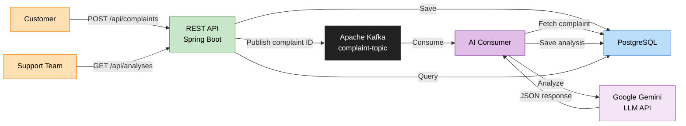

#  FoodSense AI — Intelligent Food Delivery Feedback Analysis

[](https://openjdk.org/projects/jdk/21/)
[](https://spring.io/projects/spring-boot)
[](https://kafka.apache.org/)
[](https://www.postgresql.org/)
[](https://ai.google.dev/)
[](LICENSE)
[](https://docs.docker.com/compose/)

> **An enterprise-grade, event-driven complaint analysis system** that leverages Google Gemini LLM to automatically categorize, prioritize, and summarize customer complaints from food delivery platforms.

---

##  Project Description

**FoodSense AI** is a backend system designed for food delivery platforms that need to process thousands of customer complaints efficiently. Instead of manually reading each complaint, the system uses **Google Gemini** (Large Language Model) to automatically:

- **Categorize** complaints (Delivery, Food Quality, Customer Service, etc.)
- **Analyze sentiment** (Positive, Negative, Neutral)
- **Assign priority** (Low, Medium, High, Critical)
- **Generate concise summaries** for support teams

The system uses **Apache Kafka** for asynchronous, decoupled processing — meaning the API responds instantly to the customer while AI analysis happens in the background.

> [!TIP]
> This project is ideal for **junior/associate backend developers** looking to build a portfolio piece that demonstrates real-world skills: REST APIs, event-driven architecture, LLM integration, Docker, and testing.

---

##  Architecture



---

##  Tech Stack

| Layer               | Technology           | Version   | Purpose                                     |
| ------------------- | -------------------- | -------   | ----------------------------------------    |
| **Language**        | Java                 | 21        | Core programming language (LTS)             |
| **Framework**       | Spring Boot          | 3.4.x     | Application framework & dependency injection|
| **Messaging**       | Apache Kafka         | 3.7       | Asynchronous event-driven processing        |
| **Database**        | PostgreSQL           | 16        | Persistent storage for complaints & analyses|
| **AI/LLM**          | Google Gemini        | 2.0 Flash | Natural language analysis of complaints     |
| **API Docs**        | SpringDoc OpenAPI    | 2.8       | Swagger UI & OpenAPI 3.0 spec               |
| **Containerization**| Docker Compose       | 3.8       | Multi-container orchestration               |
| **Build Tool**      | Apache Maven         | 3.9+      | Build, dependency management, testing       |
| **Testing**         | JUnit 5 + Mockito    | 5.x       | Unit and integration testing                |

---

##  Key Features

- ✅ **RESTful Complaint API** — Submit and retrieve customer complaints
- ✅ **Event-Driven Processing** — Kafka decouples submission from analysis
- ✅ **AI-Powered Analysis** — Google Gemini extracts category, sentiment, priority, and summary
- ✅ **Structured JSON Extraction** — Reliable parsing of LLM responses
- ✅ **Swagger UI** — Interactive API documentation at `/swagger-ui.html`
- ✅ **Docker Compose** — One-command infrastructure setup
- ✅ **Comprehensive Testing** — Unit tests with JUnit 5 & Mockito
- ✅ **Portfolio-Ready** — Clean architecture, documentation, and best practices

---

##  Quick Start

### 1. Clone & Configure

```bash
git clone https://github.com/your-username/foodsense-ai.git
cd foodsense-ai
```

Create a `.env` file in the project root:

```env
GEMINI_API_KEY=your-google-gemini-api-key-here
```

### 2. Start Infrastructure

```bash
docker-compose up -d
```

This starts **PostgreSQL**, **Kafka** (with Zookeeper), and the **Spring Boot application**.

### 3. Submit a Complaint

```bash
curl -X POST http://localhost:8080/api/complaints \
  -H "Content-Type: application/json" \
  -d '{
    "customerName": "Jane Smith",
    "customerEmail": "jane.smith@email.com",
    "complaintText": "I ordered a pizza from PizzaHut via your app and it arrived 2 hours late. The food was cold and the delivery driver was rude. I want a full refund.",
    "restaurantName": "PizzaHut",
    "orderNumber": "ORD-2026-78432"
  }'
```

### 4. Check the Analysis

Wait a few seconds for Kafka + Gemini processing, then:

```bash
curl http://localhost:8080/api/analyses | jq
```

---

## 📡 API Endpoints

| Method | Endpoint                              | Description                                |
| ------ | ------------------------------------- | ------------------------------------------ |
| POST   | `/api/complaints`                     | Submit a new customer complaint            |
| GET    | `/api/complaints`                     | Retrieve all complaints                    |
| GET    | `/api/complaints/{id}`                | Retrieve a specific complaint by ID        |
| GET    | `/api/analyses`                       | Retrieve all complaint analyses            |
| GET    | `/api/analyses/complaint/{complaintId}` | Retrieve analysis for a specific complaint |

>  Full API documentation with request/response examples: [docs/API_DOCUMENTATION.md](docs/API_DOCUMENTATION.md)

---

##  Kafka Flow (Brief)

```
Customer submits complaint
  → REST API saves to PostgreSQL
    → Complaint ID published to "complaint-topic"
      → AI Consumer reads message
        → Fetches full complaint from DB
          → Sends text to Google Gemini
            → Parses structured JSON response
              → Saves analysis to PostgreSQL
```

Kafka enables **asynchronous processing** — the customer gets an instant response while AI analysis happens in the background. This architecture scales horizontally by adding more consumer instances.

>  Full Kafka documentation: [docs/KAFKA_FLOW.md](docs/KAFKA_FLOW.md)

---

##  Gemini Integration (Brief)

The system sends a carefully engineered prompt to **Google Gemini 2.0 Flash** that instructs the LLM to analyze the complaint and return a structured JSON object with:

```json
{
  "category": "DELIVERY",
  "sentiment": "NEGATIVE",
  "priority": "HIGH",
  "summary": "Customer reports a 2-hour delivery delay with cold food and rude driver behavior. Requests full refund."
}
```

The response is parsed and stored as a `ComplaintAnalysis` entity linked to the original complaint.

>  Full Gemini integration documentation: [docs/GEMINI_INTEGRATION.md](docs/GEMINI_INTEGRATION.md)

---

##  Example Request & Response

### Submit a Complaint

**Request:**

```bash
curl -X POST http://localhost:8080/api/complaints \
  -H "Content-Type: application/json" \
  -d '{
    "customerName": "Jane Smith",
    "customerEmail": "jane.smith@email.com",
    "complaintText": "I ordered a pizza from PizzaHut via your app and it arrived 2 hours late. The food was cold and the delivery driver was rude. I want a full refund.",
    "restaurantName": "PizzaHut",
    "orderNumber": "ORD-2026-78432"
  }'
```

**Complaint Response:**

```json
{
  "id": "f5e6d7c8-9a0b-1c2d-3e4f-567890abcdef",
  "customerName": "Jane Smith",
  "customerEmail": "jane.smith@email.com",
  "complaintText": "I ordered a pizza from PizzaHut via your app and it arrived 2 hours late. The food was cold and the delivery driver was rude. I want a full refund.",
  "restaurantName": "PizzaHut",
  "orderNumber": "ORD-2026-78432",
  "status": "PENDING",
  "createdAt": "2026-05-30T17:00:00"
}
```

**Analysis Response** (after Kafka + Gemini processing):

```json
{
  "id": "a1b2c3d4-e5f6-7890-abcd-ef1234567890",
  "complaintId": "f5e6d7c8-9a0b-1c2d-3e4f-567890abcdef",
  "category": "DELIVERY",
  "sentiment": "NEGATIVE",
  "priority": "HIGH",
  "summary": "Customer reports a 2-hour delivery delay with cold food and rude driver behavior. Requests full refund.",
  "analyzedAt": "2026-05-30T17:00:00"
}
```

---

##  Screenshots

>  _Screenshots coming soon — Swagger UI, API responses, Kafka processing logs._

---

##  Project Structure

```
foodsense-ai/
├── src/
│   ├── main/
│   │   ├── java/com/foodsense/ai/
│   │   │   ├── config/           # Kafka, OpenAPI, Gemini configuration
│   │   │   ├── controller/       # REST controllers
│   │   │   ├── dto/              # Data Transfer Objects (request/response)
│   │   │   ├── entity/           # JPA entities
│   │   │   ├── enums/            # Category, Sentiment, Priority enums
│   │   │   ├── exception/        # Custom exceptions & global handler
│   │   │   ├── kafka/            # Kafka producer & consumer
│   │   │   ├── mapper/           # Entity ↔ DTO mappers
│   │   │   ├── repository/       # Spring Data JPA repositories
│   │   │   ├── service/          # Business logic services
│   │   │   └── FoodSenseAiApplication.java
│   │   └── resources/
│   │       ├── application.yml   # Application configuration
│   │       └── application-docker.yml
│   └── test/
│       └── java/com/foodsense/ai/
│           ├── controller/       # Controller tests (@WebMvcTest)
│           ├── service/          # Service unit tests
│           └── mapper/           # Mapper unit tests
├── docker-compose.yml            # PostgreSQL, Kafka, Zookeeper, App
├── Dockerfile                    # Multi-stage build
├── .env                          # Environment variables (GEMINI_API_KEY)
├── pom.xml                       # Maven dependencies
├── docs/                         #  Comprehensive documentation
├── README.md                     # You are here!
├── CHANGELOG.md                  # Version history
├── TASKS.md                      # Task tracking
└── PROJECT_STATUS.md             # Current project status
```

---

##  Configuration

### Key Application Properties

```yaml
# application.yml
server:
  port: 8080

spring:
  datasource:
    url: jdbc:postgresql://localhost:5432/foodsense
    username: postgres
    password: postgres
  jpa:
    hibernate:
      ddl-auto: update
    show-sql: true
  kafka:
    bootstrap-servers: localhost:9092
    consumer:
      group-id: complaint-analysis-group
      auto-offset-reset: earliest

gemini:
  api:
    key: ${GEMINI_API_KEY}
    url: https://generativelanguage.googleapis.com/v1beta/models/gemini-2.0-flash:generateContent
```

### Environment Variables

| Variable         | Description                  | Required |
| ---------------- | ---------------------------- | -------- |
| `GEMINI_API_KEY` | Google Gemini API key        | ✅ Yes    |
| `DB_HOST`        | PostgreSQL host              | No (default: `localhost`) |
| `DB_PORT`        | PostgreSQL port              | No (default: `5432`)     |
| `KAFKA_SERVERS`  | Kafka bootstrap servers      | No (default: `localhost:9092`) |

---

##  Running Tests

```bash
# Run all tests
mvn test

# Run with verbose output
mvn test -Dtest.verbose=true

# Run a specific test class
mvn test -Dtest=ComplaintServiceTest
```

>  Full testing documentation: [docs/TESTING.md](docs/TESTING.md)

---

##  Contributing

Contributions are welcome! Here's how:

1. **Fork** the repository
2. **Create** a feature branch (`git checkout -b feature/amazing-feature`)
3. **Commit** your changes (`git commit -m 'Add amazing feature'`)
4. **Push** to the branch (`git push origin feature/amazing-feature`)
5. **Open** a Pull Request

Please ensure:
- All existing tests pass (`mvn test`)
- New code includes appropriate tests
- Code follows the existing project conventions
- Documentation is updated if needed

##  Documentation

| Document | Description |
| --- | --- |
| [Project Overview](docs/PROJECT_OVERVIEW.md) | High-level project overview and business value |
| [Architecture](docs/ARCHITECTURE.md) | System architecture, patterns, and design decisions |
| [Setup Guide](docs/SETUP_GUIDE.md) | Step-by-step setup instructions |
| [API Documentation](docs/API_DOCUMENTATION.md) | Full REST API reference with examples |
| [Kafka Flow](docs/KAFKA_FLOW.md) | Event-driven architecture details |
| [Gemini Integration](docs/GEMINI_INTEGRATION.md) | LLM integration and prompt engineering |
| [Database Schema](docs/DATABASE_SCHEMA.md) | ER diagrams and schema details |
| [Testing](docs/TESTING.md) | Testing strategy and examples |
| [Deployment](docs/DEPLOYMENT.md) | Docker deployment and production guidance |

---

<p align="center">
  Built for learning and portfolio building.<br/>
  <strong>FoodSense AI</strong> — Turning complaints into insights.
</p>
