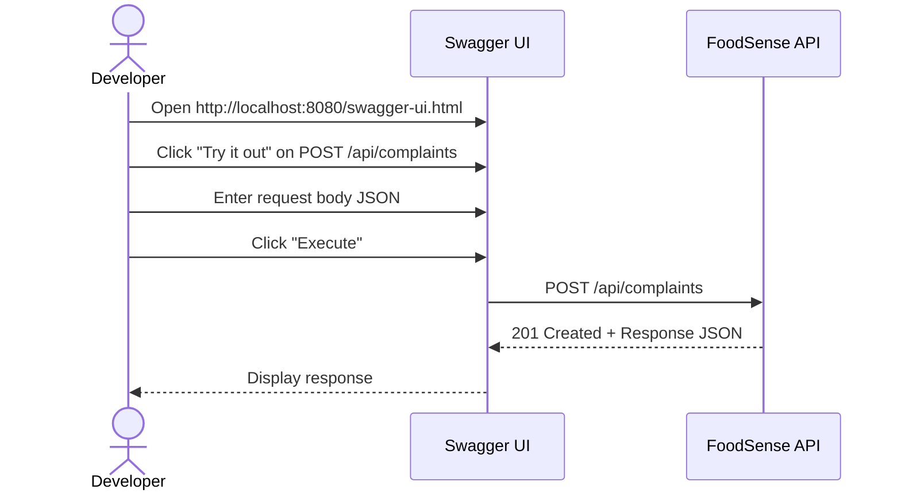

# 📡 API Documentation — FoodSense AI

## Table of Contents

- [Overview](#-overview)
- [Base URL](#-base-url)
- [Authentication](#-authentication)
- [Endpoints Summary](#-endpoints-summary)
- [Complaint Endpoints](#-complaint-endpoints)
- [Analysis Endpoints](#-analysis-endpoints)
- [Error Responses](#-error-responses)
- [Swagger UI](#-swagger-ui)

---

## 📋 Overview

FoodSense AI exposes a RESTful API for managing customer complaints and retrieving AI-powered analyses. All requests and responses use **JSON** format.

| Aspect          | Details                                    |
| --------------- | ------------------------------------------ |
| **Protocol**    | HTTP/HTTPS                                 |
| **Format**      | JSON (`application/json`)                  |
| **Encoding**    | UTF-8                                      |
| **API Version** | v1 (current)                               |
| **Spec**        | OpenAPI 3.0 (auto-generated via SpringDoc) |

---

## 🌐 Base URL

| Environment   | Base URL                           |
| ------------- | ---------------------------------- |
| **Local Dev** | `http://localhost:8080`            |
| **Docker**    | `http://localhost:8080`            |
| **Production**| `https://api.foodsense.ai` (future) |

All endpoints are prefixed with `/api/`.

---

## 🔑 Authentication

> [!NOTE]
> **No authentication is required for v1.0.0.** All endpoints are publicly accessible. Authentication via Spring Security + JWT is planned for a future release.

---

## 📊 Endpoints Summary

| Method | Endpoint                                  | Description                                | Status Codes       |
| ------ | ----------------------------------------- | ------------------------------------------ | ------------------- |
| POST   | `/api/complaints`                         | Submit a new customer complaint            | 201, 400            |
| GET    | `/api/complaints`                         | Retrieve all complaints                    | 200                 |
| GET    | `/api/complaints/{id}`                    | Retrieve a specific complaint by UUID      | 200, 404            |
| GET    | `/api/analyses`                           | Retrieve all complaint analyses            | 200                 |
| GET    | `/api/analyses/complaint/{complaintId}`   | Retrieve analysis for a specific complaint | 200, 404            |

---

## 📝 Complaint Endpoints

### POST `/api/complaints` — Submit a New Complaint

Creates a new customer complaint, saves it to the database, and publishes it to Kafka for asynchronous AI analysis.

**Request:**

| Field             | Type   | Required | Description                              |
| ----------------- | ------ | -------- | ---------------------------------------- |
| `customerName`    | String | ✅ Yes    | Full name of the customer                |
| `customerEmail`   | String | ✅ Yes    | Valid email address                      |
| `complaintText`   | String | ✅ Yes    | Full text of the complaint               |
| `restaurantName`  | String | No       | Name of the restaurant                   |
| `orderNumber`     | String | No       | Order reference number                   |

**Request Body:**

```json
{
  "customerName": "Jane Smith",
  "customerEmail": "jane.smith@email.com",
  "complaintText": "I ordered a pizza from PizzaHut via your app and it arrived 2 hours late. The food was cold and the delivery driver was rude. I want a full refund.",
  "restaurantName": "PizzaHut",
  "orderNumber": "ORD-2026-78432"
}
```

**Response:** `201 Created`

```json
{
  "id": "f5e6d7c8-9a0b-1c2d-3e4f-567890abcdef",
  "customerName": "Jane Smith",
  "customerEmail": "jane.smith@email.com",
  "complaintText": "I ordered a pizza from PizzaHut via your app and it arrived 2 hours late. The food was cold and the delivery driver was rude. I want a full refund.",
  "restaurantName": "PizzaHut",
  "orderNumber": "ORD-2026-78432",
  "status": "PENDING",
  "createdAt": "2026-05-30T17:00:00"
}
```

**Status Codes:**

| Code | Description                                          |
| ---- | ---------------------------------------------------- |
| 201  | Complaint created successfully                       |
| 400  | Validation error (missing required fields, invalid email) |

**Example `curl`:**

```bash
curl -X POST http://localhost:8080/api/complaints \
  -H "Content-Type: application/json" \
  -d '{
    "customerName": "Jane Smith",
    "customerEmail": "jane.smith@email.com",
    "complaintText": "I ordered a pizza from PizzaHut via your app and it arrived 2 hours late. The food was cold and the delivery driver was rude. I want a full refund.",
    "restaurantName": "PizzaHut",
    "orderNumber": "ORD-2026-78432"
  }'
```

**Example `curl` — Minimal Request (only required fields):**

```bash
curl -X POST http://localhost:8080/api/complaints \
  -H "Content-Type: application/json" \
  -d '{
    "customerName": "John Doe",
    "customerEmail": "john@example.com",
    "complaintText": "My order never arrived and I was charged twice."
  }'
```

> [!TIP]
> After submitting a complaint, the AI analysis happens **asynchronously** via Kafka. Wait 3-5 seconds, then check the analysis endpoint.

---

### GET `/api/complaints` — Get All Complaints

Retrieves a list of all customer complaints.

**Parameters:** None

**Response:** `200 OK`

```json
[
  {
    "id": "f5e6d7c8-9a0b-1c2d-3e4f-567890abcdef",
    "customerName": "Jane Smith",
    "customerEmail": "jane.smith@email.com",
    "complaintText": "I ordered a pizza from PizzaHut via your app and it arrived 2 hours late. The food was cold and the delivery driver was rude. I want a full refund.",
    "restaurantName": "PizzaHut",
    "orderNumber": "ORD-2026-78432",
    "status": "ANALYZED",
    "createdAt": "2026-05-30T17:00:00"
  },
  {
    "id": "b2c3d4e5-f6a7-8901-bcde-f23456789012",
    "customerName": "John Doe",
    "customerEmail": "john.doe@email.com",
    "complaintText": "The burger I received was completely wrong. I ordered a veggie burger but got a chicken burger instead. I'm vegetarian!",
    "restaurantName": "BurgerKing",
    "orderNumber": "ORD-2026-10234",
    "status": "ANALYZED",
    "createdAt": "2026-05-30T16:30:00"
  }
]
```

**Status Codes:**

| Code | Description                |
| ---- | -------------------------- |
| 200  | Success (may return `[]`)  |

**Example `curl`:**

```bash
curl http://localhost:8080/api/complaints | jq
```

---

### GET `/api/complaints/{id}` — Get Complaint by ID

Retrieves a single complaint by its UUID.

**Path Parameters:**

| Parameter | Type | Description                  |
| --------- | ---- | ---------------------------- |
| `id`      | UUID | Unique complaint identifier  |

**Response:** `200 OK`

```json
{
  "id": "f5e6d7c8-9a0b-1c2d-3e4f-567890abcdef",
  "customerName": "Jane Smith",
  "customerEmail": "jane.smith@email.com",
  "complaintText": "I ordered a pizza from PizzaHut via your app and it arrived 2 hours late. The food was cold and the delivery driver was rude. I want a full refund.",
  "restaurantName": "PizzaHut",
  "orderNumber": "ORD-2026-78432",
  "status": "ANALYZED",
  "createdAt": "2026-05-30T17:00:00"
}
```

**Error Response:** `404 Not Found`

```json
{
  "status": 404,
  "message": "Complaint not found with id: f5e6d7c8-9a0b-1c2d-3e4f-567890abcdef",
  "timestamp": "2026-05-30T17:05:00"
}
```

**Status Codes:**

| Code | Description                   |
| ---- | ----------------------------- |
| 200  | Complaint found               |
| 404  | Complaint not found           |

**Example `curl`:**

```bash
curl http://localhost:8080/api/complaints/f5e6d7c8-9a0b-1c2d-3e4f-567890abcdef | jq
```

---

## 🤖 Analysis Endpoints

### GET `/api/analyses` — Get All Analyses

Retrieves a list of all complaint analyses generated by the AI.

**Parameters:** None

**Response:** `200 OK`

```json
[
  {
    "id": "a1b2c3d4-e5f6-7890-abcd-ef1234567890",
    "complaintId": "f5e6d7c8-9a0b-1c2d-3e4f-567890abcdef",
    "category": "DELIVERY",
    "sentiment": "NEGATIVE",
    "priority": "HIGH",
    "summary": "Customer reports a 2-hour delivery delay with cold food and rude driver behavior. Requests full refund.",
    "analyzedAt": "2026-05-30T17:00:00"
  },
  {
    "id": "c3d4e5f6-a7b8-9012-cdef-345678901234",
    "complaintId": "b2c3d4e5-f6a7-8901-bcde-f23456789012",
    "category": "FOOD_QUALITY",
    "sentiment": "NEGATIVE",
    "priority": "HIGH",
    "summary": "Incorrect order delivered — customer received chicken burger instead of requested veggie burger. Customer is vegetarian, potential dietary concern.",
    "analyzedAt": "2026-05-30T16:35:00"
  }
]
```

**Status Codes:**

| Code | Description                |
| ---- | -------------------------- |
| 200  | Success (may return `[]`)  |

**Example `curl`:**

```bash
curl http://localhost:8080/api/analyses | jq
```

---

### GET `/api/analyses/complaint/{complaintId}` — Get Analysis by Complaint ID

Retrieves the AI analysis associated with a specific complaint.

**Path Parameters:**

| Parameter      | Type | Description                          |
| -------------- | ---- | ------------------------------------ |
| `complaintId`  | UUID | UUID of the original complaint       |

**Response:** `200 OK`

```json
{
  "id": "a1b2c3d4-e5f6-7890-abcd-ef1234567890",
  "complaintId": "f5e6d7c8-9a0b-1c2d-3e4f-567890abcdef",
  "category": "DELIVERY",
  "sentiment": "NEGATIVE",
  "priority": "HIGH",
  "summary": "Customer reports a 2-hour delivery delay with cold food and rude driver behavior. Requests full refund.",
  "analyzedAt": "2026-05-30T17:00:00"
}
```

**Error Response:** `404 Not Found`

```json
{
  "status": 404,
  "message": "Analysis not found for complaint id: f5e6d7c8-9a0b-1c2d-3e4f-567890abcdef",
  "timestamp": "2026-05-30T17:05:00"
}
```

**Status Codes:**

| Code | Description                           |
| ---- | ------------------------------------- |
| 200  | Analysis found                        |
| 404  | No analysis found for this complaint  |

**Example `curl`:**

```bash
curl http://localhost:8080/api/analyses/complaint/f5e6d7c8-9a0b-1c2d-3e4f-567890abcdef | jq
```

---

## ❌ Error Responses

All error responses follow a consistent format:

### Error Response Schema

| Field       | Type          | Description                              |
| ----------- | ------------- | ---------------------------------------- |
| `status`    | Integer       | HTTP status code                         |
| `message`   | String        | Human-readable error message             |
| `timestamp` | ISO DateTime  | When the error occurred                  |

### Error Examples

**400 — Validation Error (Missing Required Field):**

```json
{
  "status": 400,
  "message": "Validation failed: customerName must not be blank",
  "timestamp": "2026-05-30T17:05:00"
}
```

**400 — Validation Error (Invalid Email):**

```json
{
  "status": 400,
  "message": "Validation failed: customerEmail must be a valid email address",
  "timestamp": "2026-05-30T17:05:00"
}
```

**404 — Resource Not Found:**

```json
{
  "status": 404,
  "message": "Complaint not found with id: 00000000-0000-0000-0000-000000000000",
  "timestamp": "2026-05-30T17:05:00"
}
```

**500 — Internal Server Error:**

```json
{
  "status": 500,
  "message": "An unexpected error occurred. Please try again later.",
  "timestamp": "2026-05-30T17:05:00"
}
```

### HTTP Status Code Reference

| Code | Meaning                | When It's Returned                                  |
| ---- | ---------------------- | --------------------------------------------------- |
| 200  | OK                     | Successful GET request                              |
| 201  | Created                | Successful POST request (complaint created)         |
| 400  | Bad Request            | Validation error in request body                    |
| 404  | Not Found              | Requested resource doesn't exist                    |
| 500  | Internal Server Error  | Unexpected server-side error                        |

---

## 📘 Swagger UI

FoodSense AI includes an interactive API documentation interface powered by **SpringDoc OpenAPI**.

### Access Swagger UI

Open your browser and navigate to:

```
http://localhost:8080/swagger-ui.html
```

### Available Documentation URLs

| URL                                              | Description                           |
| ------------------------------------------------ | ------------------------------------- |
| `http://localhost:8080/swagger-ui.html`           | Interactive Swagger UI                |
| `http://localhost:8080/v3/api-docs`               | OpenAPI 3.0 JSON specification        |
| `http://localhost:8080/v3/api-docs.yaml`          | OpenAPI 3.0 YAML specification        |

### Using Swagger UI

1. **Navigate** to `http://localhost:8080/swagger-ui.html`
2. **Expand** an endpoint section (e.g., "complaint-controller")
3. **Click** "Try it out" on any endpoint
4. **Fill in** the request body or path parameters
5. **Click** "Execute" to send the request
6. **View** the response body, status code, and headers



> [!TIP]
> Swagger UI is the fastest way to test your API during development. No need to install Postman or write curl commands — everything is available in the browser.

---

## 📋 Complete Request/Response Flow Example

Here's a complete end-to-end example showing the full lifecycle:

### Step 1: Submit Complaint

```bash
curl -X POST http://localhost:8080/api/complaints \
  -H "Content-Type: application/json" \
  -d '{
    "customerName": "Jane Smith",
    "customerEmail": "jane.smith@email.com",
    "complaintText": "I ordered a pizza from PizzaHut via your app and it arrived 2 hours late. The food was cold and the delivery driver was rude. I want a full refund.",
    "restaurantName": "PizzaHut",
    "orderNumber": "ORD-2026-78432"
  }'
```

**Response:**
```json
{
  "id": "f5e6d7c8-9a0b-1c2d-3e4f-567890abcdef",
  "customerName": "Jane Smith",
  "customerEmail": "jane.smith@email.com",
  "complaintText": "I ordered a pizza from PizzaHut via your app and it arrived 2 hours late. The food was cold and the delivery driver was rude. I want a full refund.",
  "restaurantName": "PizzaHut",
  "orderNumber": "ORD-2026-78432",
  "status": "PENDING",
  "createdAt": "2026-05-30T17:00:00"
}
```

### Step 2: Wait for AI Analysis (3-5 seconds)

The complaint ID is published to Kafka → consumed by the AI Consumer → sent to Gemini → analysis saved.

### Step 3: Retrieve the Analysis

```bash
curl http://localhost:8080/api/analyses/complaint/f5e6d7c8-9a0b-1c2d-3e4f-567890abcdef | jq
```

**Response:**
```json
{
  "id": "a1b2c3d4-e5f6-7890-abcd-ef1234567890",
  "complaintId": "f5e6d7c8-9a0b-1c2d-3e4f-567890abcdef",
  "category": "DELIVERY",
  "sentiment": "NEGATIVE",
  "priority": "HIGH",
  "summary": "Customer reports a 2-hour delivery delay with cold food and rude driver behavior. Requests full refund.",
  "analyzedAt": "2026-05-30T17:00:00"
}
```

### Step 4: Verify Complaint Status Updated

```bash
curl http://localhost:8080/api/complaints/f5e6d7c8-9a0b-1c2d-3e4f-567890abcdef | jq
```

**Response (notice status changed from PENDING to ANALYZED):**
```json
{
  "id": "f5e6d7c8-9a0b-1c2d-3e4f-567890abcdef",
  "customerName": "Jane Smith",
  "customerEmail": "jane.smith@email.com",
  "complaintText": "I ordered a pizza from PizzaHut via your app and it arrived 2 hours late. The food was cold and the delivery driver was rude. I want a full refund.",
  "restaurantName": "PizzaHut",
  "orderNumber": "ORD-2026-78432",
  "status": "ANALYZED",
  "createdAt": "2026-05-30T17:00:00"
}
```
