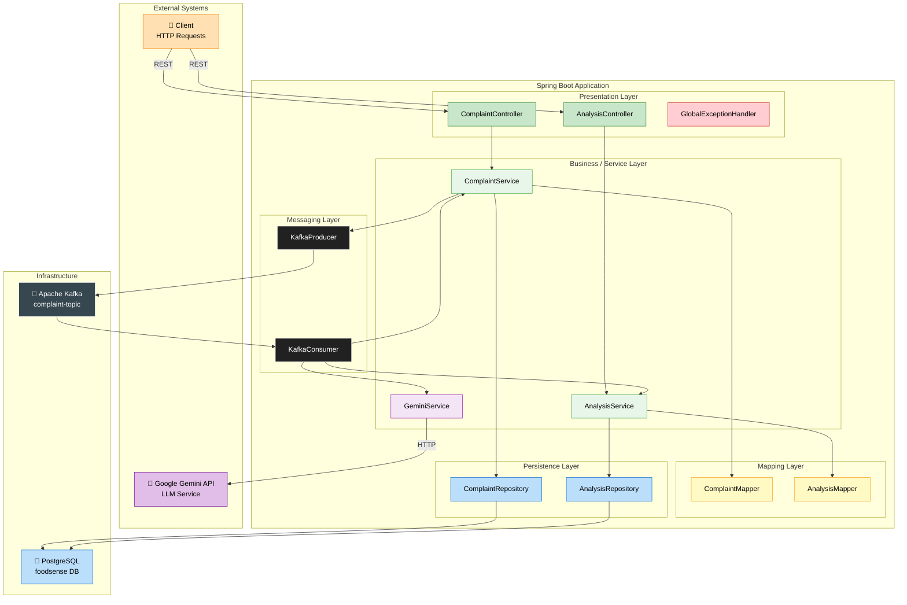
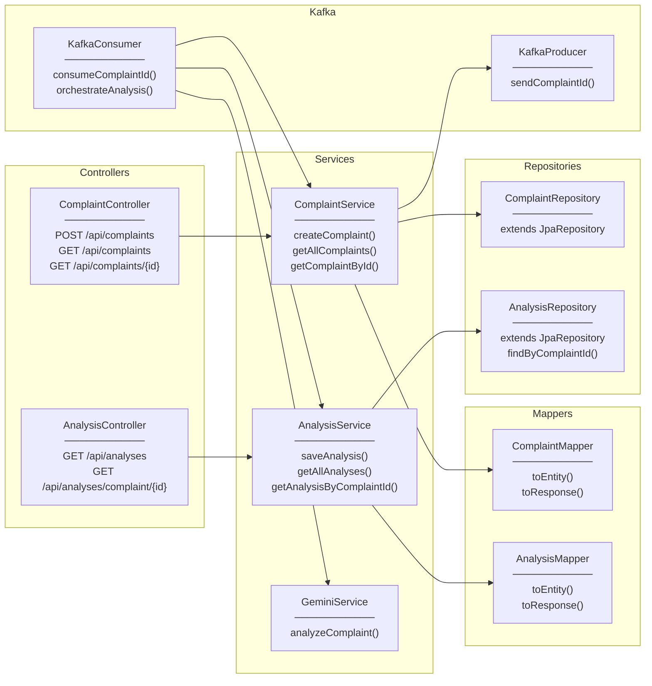
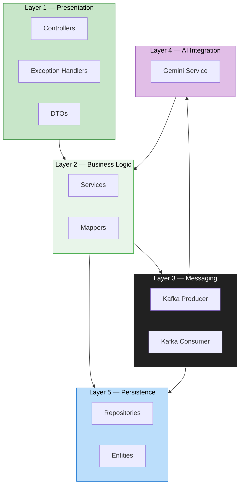
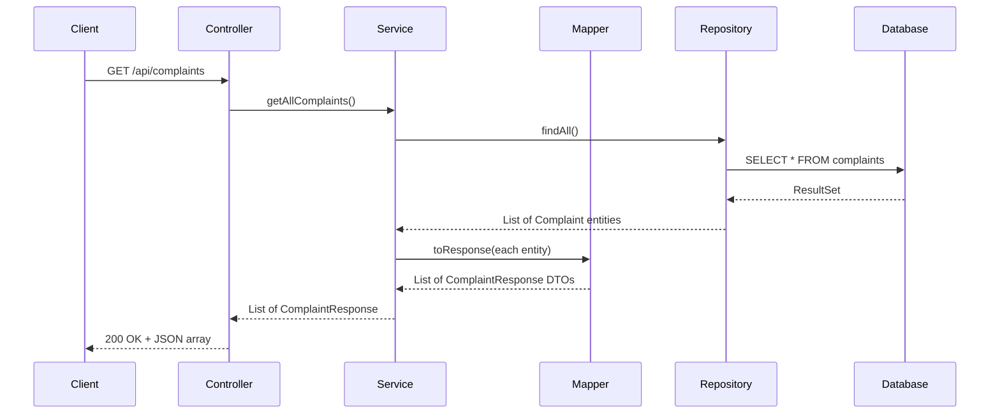
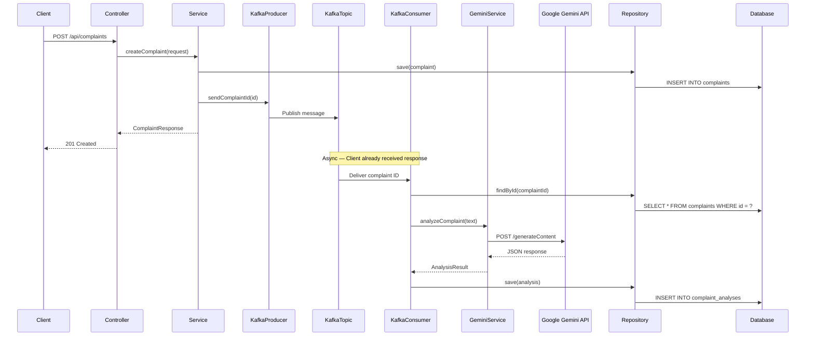
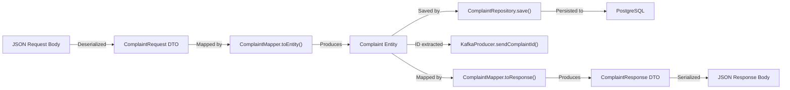
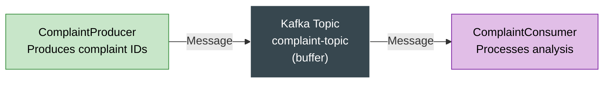

# 🏗️ Architecture Guide — FoodSense AI

## Table of Contents

- [System Architecture](#-system-architecture)
- [Component Diagram](#-component-diagram)
- [Package Structure](#-package-structure)
- [Layer Descriptions](#-layer-descriptions)
- [Data Flow Diagrams](#-data-flow-diagrams)
- [Design Patterns](#-design-patterns-used)
- [SOLID Principles](#-solid-principles-applied)

---

## 🌐 System Architecture

FoodSense AI follows a **layered architecture** with **event-driven processing**. The system is composed of five major layers that communicate through well-defined interfaces.



---

## 🧩 Component Diagram

This diagram shows the individual components and their responsibilities:



---

## 📁 Package Structure

```
src/main/java/com/foodsense/ai/
│
├── FoodSenseAiApplication.java          # Main entry point (@SpringBootApplication)
│
├── config/                               # Configuration classes
│   ├── KafkaConfig.java                 # Kafka topic and producer/consumer config
│   ├── OpenApiConfig.java               # Swagger/OpenAPI configuration
│   └── GeminiConfig.java               # Gemini API RestTemplate and properties
│
├── controller/                           # REST Controllers (Presentation Layer)
│   ├── ComplaintController.java         # Complaint CRUD endpoints
│   └── AnalysisController.java          # Analysis query endpoints
│
├── dto/                                  # Data Transfer Objects
│   ├── request/
│   │   └── ComplaintRequest.java        # Incoming complaint data
│   └── response/
│       ├── ComplaintResponse.java       # Outgoing complaint data
│       └── AnalysisResponse.java        # Outgoing analysis data
│
├── entity/                               # JPA Entities (Domain Model)
│   ├── Complaint.java                   # Complaint table mapping
│   └── ComplaintAnalysis.java           # Analysis table mapping
│
├── enums/                                # Enumeration types
│   ├── ComplaintCategory.java           # DELIVERY, FOOD_QUALITY, etc.
│   ├── SentimentType.java              # POSITIVE, NEGATIVE, NEUTRAL
│   ├── PriorityLevel.java              # LOW, MEDIUM, HIGH, CRITICAL
│   └── ComplaintStatus.java            # PENDING, ANALYZED, FAILED
│
├── exception/                            # Exception handling
│   ├── ResourceNotFoundException.java   # 404 custom exception
│   ├── GeminiApiException.java         # Gemini API error wrapper
│   └── GlobalExceptionHandler.java     # @ControllerAdvice handler
│
├── kafka/                                # Kafka components
│   ├── ComplaintProducer.java           # Publishes complaint IDs
│   └── ComplaintConsumer.java           # Consumes and orchestrates analysis
│
├── mapper/                               # Entity ↔ DTO mappers
│   ├── ComplaintMapper.java             # Complaint entity/DTO conversion
│   └── AnalysisMapper.java             # Analysis entity/DTO conversion
│
├── repository/                           # Spring Data JPA repositories
│   ├── ComplaintRepository.java         # Complaint data access
│   └── AnalysisRepository.java          # Analysis data access
│
└── service/                              # Business logic
    ├── ComplaintService.java            # Complaint business operations
    ├── AnalysisService.java             # Analysis business operations
    └── GeminiService.java              # Gemini LLM API integration
```

> [!NOTE]
> Each package has a **single, clear responsibility**. This structure follows the principle of **separation of concerns** and makes the codebase navigable for any developer.

---

## 📚 Layer Descriptions

### Layer Overview



---

### Layer 1 — Presentation Layer (Controllers)

**Responsibility:** Handle HTTP requests and responses. No business logic here.

| Component              | Role                                                         |
| ---------------------- | ------------------------------------------------------------ |
| `ComplaintController`  | Accepts complaint submissions, returns complaint data        |
| `AnalysisController`   | Serves analysis query endpoints                              |
| `GlobalExceptionHandler` | Catches exceptions and returns standardized error responses |
| DTOs                   | Define the shape of request/response JSON bodies             |

**Flow:**
```
HTTP Request → Controller → Validate → Call Service → Return DTO Response
```

**Example:**
```java
@RestController
@RequestMapping("/api/complaints")
public class ComplaintController {

    private final ComplaintService complaintService;

    @PostMapping
    public ResponseEntity<ComplaintResponse> createComplaint(
            @Valid @RequestBody ComplaintRequest request) {
        ComplaintResponse response = complaintService.createComplaint(request);
        return ResponseEntity.status(HttpStatus.CREATED).body(response);
    }
}
```

> [!TIP]
> Controllers should be **thin** — they only handle HTTP concerns (status codes, request binding). All business logic lives in the service layer.

---

### Layer 2 — Business Logic Layer (Services)

**Responsibility:** Execute business rules, coordinate between layers, and orchestrate workflows.

| Component          | Role                                                         |
| ------------------ | ------------------------------------------------------------ |
| `ComplaintService`  | Creates complaints, publishes to Kafka, queries complaint data |
| `AnalysisService`   | Saves and retrieves analysis results                         |
| `GeminiService`     | Sends complaint text to Gemini API and parses the response   |

**Example:**
```java
@Service
public class ComplaintService {

    private final ComplaintRepository repository;
    private final ComplaintMapper mapper;
    private final ComplaintProducer kafkaProducer;

    public ComplaintResponse createComplaint(ComplaintRequest request) {
        // 1. Map DTO to entity
        Complaint complaint = mapper.toEntity(request);
        complaint.setStatus(ComplaintStatus.PENDING);

        // 2. Save to database
        Complaint saved = repository.save(complaint);

        // 3. Publish to Kafka for async processing
        kafkaProducer.sendComplaintId(saved.getId().toString());

        // 4. Return response DTO
        return mapper.toResponse(saved);
    }
}
```

---

### Layer 3 — Messaging Layer (Kafka)

**Responsibility:** Decouple complaint submission from AI analysis via asynchronous messaging.

| Component            | Role                                                       |
| -------------------- | ---------------------------------------------------------- |
| `ComplaintProducer`   | Publishes complaint IDs to `complaint-topic`               |
| `ComplaintConsumer`   | Consumes messages, orchestrates the full analysis pipeline |

**Key concept:** The producer and consumer are in **separate execution contexts**. The producer fires and forgets. The consumer runs independently and processes messages at its own pace.

---

### Layer 4 — AI Integration Layer

**Responsibility:** Communicate with Google Gemini API for natural language analysis.

| Component        | Role                                                         |
| ---------------- | ------------------------------------------------------------ |
| `GeminiService`  | Constructs prompt, sends HTTP request, parses JSON response  |

---

### Layer 5 — Persistence Layer (Repositories + Entities)

**Responsibility:** Data access and storage using Spring Data JPA.

| Component              | Role                                                |
| ---------------------- | --------------------------------------------------- |
| `ComplaintRepository`  | CRUD operations for `complaints` table              |
| `AnalysisRepository`   | CRUD operations + custom queries for `analyses` table |
| `Complaint` entity     | JPA mapping for `complaints` table                  |
| `ComplaintAnalysis` entity | JPA mapping for `complaint_analyses` table      |

---

### The Two Request Flows

**Flow 1: Synchronous (REST API → Service → Repository → Database)**



**Flow 2: Asynchronous (Controller → Service → Kafka → Consumer → Gemini → Repository)**



---

## 🔄 Data Flow Diagrams

### Complaint Submission Flow



### Analysis Pipeline Flow

```mermaid
flowchart LR
    A["Kafka Message<br/>(complaint ID)"] -->|Consumed by| B["KafkaConsumer"]
    B -->|Fetches| C["Complaint Entity"]
    C -->|Text extracted| D["GeminiService.analyzeComplaint()"]
    D -->|HTTP POST| E["Google Gemini API"]
    E -->|Returns| F["Raw JSON String"]
    F -->|Parsed by| G["JSON Parser"]
    G -->|Creates| H["ComplaintAnalysis Entity"]
    H -->|Saved by| I["AnalysisRepository.save()"]
    I -->|Persisted to| J["PostgreSQL"]
```



---

## 🎨 Design Patterns Used

### 1. Repository Pattern

**What:** Abstracts database access behind a clean interface, hiding SQL/JPA details from business logic.

**Where:** `ComplaintRepository`, `AnalysisRepository`

**Why:** Services don't need to know about SQL queries, JPA criteria, or database specifics. They just call `repository.save()` or `repository.findById()`.

```java
// Repository — Clean interface, no SQL exposed
public interface ComplaintRepository extends JpaRepository<Complaint, UUID> {
    // Spring Data JPA auto-generates the implementation
}

// Service — Uses repository without knowing about SQL
Complaint complaint = complaintRepository.findById(id)
    .orElseThrow(() -> new ResourceNotFoundException("Complaint not found"));
```

---

### 2. DTO (Data Transfer Object) Pattern

**What:** Separate objects for API request/response that are different from database entities.

**Where:** `ComplaintRequest`, `ComplaintResponse`, `AnalysisResponse`

**Why:** 
- **Security:** Don't expose internal entity structure (e.g., database IDs, internal status)
- **Flexibility:** API shape can evolve independently of database schema
- **Validation:** DTOs have validation annotations (`@NotBlank`, `@Email`), entities don't

```java
// Request DTO — Only fields the client should send
public class ComplaintRequest {
    @NotBlank
    private String customerName;

    @Email
    private String customerEmail;

    @NotBlank
    private String complaintText;

    private String restaurantName;
    private String orderNumber;
}

// Response DTO — Only fields the client should see
public class ComplaintResponse {
    private UUID id;
    private String customerName;
    private String complaintText;
    private String status;
    private LocalDateTime createdAt;
    // Note: no customerEmail exposed in response for privacy
}
```

---

### 3. Builder Pattern

**What:** Construct complex objects step-by-step instead of using massive constructors.

**Where:** Entity and DTO creation (via Lombok `@Builder`)

**Why:** Improves readability when creating objects with many fields.

```java
// Without Builder — Hard to read, easy to mix up parameters
Complaint complaint = new Complaint(null, "Jane", "jane@email.com",
    "Complaint text...", "PizzaHut", "ORD-123", ComplaintStatus.PENDING,
    LocalDateTime.now());

// With Builder — Clear and readable
Complaint complaint = Complaint.builder()
    .customerName("Jane Smith")
    .customerEmail("jane@email.com")
    .complaintText("Complaint text...")
    .restaurantName("PizzaHut")
    .orderNumber("ORD-123")
    .status(ComplaintStatus.PENDING)
    .createdAt(LocalDateTime.now())
    .build();
```

---

### 4. Producer-Consumer Pattern

**What:** One component produces messages, another component consumes them independently.

**Where:** `ComplaintProducer` → Kafka Topic → `ComplaintConsumer`

**Why:** 
- **Decoupling:** Producer doesn't know about the consumer
- **Scalability:** Add more consumers to handle higher load
- **Resilience:** If the consumer is down, messages queue up in Kafka



---

### 5. Mapper Pattern

**What:** Centralized conversion logic between entities and DTOs.

**Where:** `ComplaintMapper`, `AnalysisMapper`

**Why:** 
- **DRY:** Conversion logic in one place, not duplicated across services
- **Testability:** Mappers can be unit tested independently
- **Maintainability:** Schema changes only affect mapper, not every service

```java
@Component
public class ComplaintMapper {

    public Complaint toEntity(ComplaintRequest request) {
        return Complaint.builder()
            .customerName(request.getCustomerName())
            .customerEmail(request.getCustomerEmail())
            .complaintText(request.getComplaintText())
            .restaurantName(request.getRestaurantName())
            .orderNumber(request.getOrderNumber())
            .build();
    }

    public ComplaintResponse toResponse(Complaint entity) {
        return ComplaintResponse.builder()
            .id(entity.getId())
            .customerName(entity.getCustomerName())
            .complaintText(entity.getComplaintText())
            .restaurantName(entity.getRestaurantName())
            .orderNumber(entity.getOrderNumber())
            .status(entity.getStatus().name())
            .createdAt(entity.getCreatedAt())
            .build();
    }
}
```

---

### 6. Global Exception Handler Pattern

**What:** Centralized error handling using `@ControllerAdvice` to catch exceptions and return consistent error responses.

**Where:** `GlobalExceptionHandler`

**Why:** 
- Every endpoint returns errors in the **same format**
- No try-catch blocks cluttering controller code
- Easy to add new exception types

```java
@RestControllerAdvice
public class GlobalExceptionHandler {

    @ExceptionHandler(ResourceNotFoundException.class)
    public ResponseEntity<ErrorResponse> handleNotFound(ResourceNotFoundException ex) {
        ErrorResponse error = new ErrorResponse(
            HttpStatus.NOT_FOUND.value(),
            ex.getMessage(),
            LocalDateTime.now()
        );
        return ResponseEntity.status(HttpStatus.NOT_FOUND).body(error);
    }
}
```

---

## 🏛️ SOLID Principles Applied

### S — Single Responsibility Principle

> _"A class should have only one reason to change."_

Each class in FoodSense AI has exactly **one job**:

| Class                   | Single Responsibility                              |
| ----------------------- | -------------------------------------------------- |
| `ComplaintController`   | Handle HTTP requests for complaints                |
| `ComplaintService`      | Execute complaint business logic                   |
| `ComplaintMapper`       | Convert between entity and DTO                     |
| `ComplaintRepository`   | Data access for complaints                         |
| `ComplaintProducer`     | Publish messages to Kafka                          |
| `ComplaintConsumer`     | Consume messages and orchestrate analysis          |
| `GeminiService`         | Communicate with Gemini API                        |
| `GlobalExceptionHandler`| Convert exceptions to HTTP error responses         |

**Example violation (what NOT to do):**
```java
// ❌ BAD — Controller does business logic, data access, AND error handling
@PostMapping
public ResponseEntity<?> createComplaint(@RequestBody Map<String, String> body) {
    try {
        Complaint c = new Complaint();
        c.setCustomerName(body.get("customerName"));
        entityManager.persist(c);  // Direct DB access in controller!
        kafkaTemplate.send("topic", c.getId().toString());  // Kafka in controller!
        return ResponseEntity.ok(c);
    } catch (Exception e) {
        return ResponseEntity.status(500).body(e.getMessage());
    }
}
```

**Correct approach (what we do):**
```java
// ✅ GOOD — Controller only handles HTTP concerns
@PostMapping
public ResponseEntity<ComplaintResponse> createComplaint(
        @Valid @RequestBody ComplaintRequest request) {
    ComplaintResponse response = complaintService.createComplaint(request);
    return ResponseEntity.status(HttpStatus.CREATED).body(response);
}
```

---

### O — Open/Closed Principle

> _"Software entities should be open for extension but closed for modification."_

**Where applied:**
- **Enums for categories/priorities** — To add a new complaint category (e.g., `PACKAGING`), just add a value to the `ComplaintCategory` enum. No service code changes needed.
- **`GlobalExceptionHandler`** — To handle a new exception type, add a new `@ExceptionHandler` method. Existing handlers don't change.
- **Repository interface** — To add a new query, add a method declaration. Existing queries don't change.

```java
// Adding a new query — Open for extension
public interface AnalysisRepository extends JpaRepository<ComplaintAnalysis, UUID> {
    Optional<ComplaintAnalysis> findByComplaintId(UUID complaintId);

    // Extension: Add new query without modifying existing code
    List<ComplaintAnalysis> findByCategory(ComplaintCategory category);
    List<ComplaintAnalysis> findByPriority(PriorityLevel priority);
}
```

---

### L — Liskov Substitution Principle

> _"Objects of a superclass should be replaceable with objects of a subclass without affecting correctness."_

**Where applied:**
- `ComplaintRepository extends JpaRepository<Complaint, UUID>` — Anywhere a `JpaRepository` is expected, our `ComplaintRepository` works seamlessly.
- All Spring-managed beans injected via interfaces can be substituted with alternative implementations (e.g., for testing).

---

### I — Interface Segregation Principle

> _"No client should be forced to depend on methods it does not use."_

**Where applied:**
- **Separate Controllers** — `ComplaintController` and `AnalysisController` are separate. The support team dashboard only needs `AnalysisController`, not complaint submission.
- **Focused Service interfaces** — Each service exposes only the methods relevant to its clients.
- **Separate DTOs** — `ComplaintRequest` and `ComplaintResponse` are different classes. The request doesn't include `id` or `createdAt`, the response doesn't include validation annotations.

---

### D — Dependency Inversion Principle

> _"High-level modules should not depend on low-level modules. Both should depend on abstractions."_

**Where applied:**
- **Controllers depend on Service interfaces**, not on database details
- **Services depend on Repository interfaces**, not on specific JPA implementations
- **Spring DI** manages all object creation and wiring

```java
// Controller depends on service abstraction, not on database
@RestController
public class ComplaintController {
    private final ComplaintService complaintService; // Abstraction
    // Controller knows NOTHING about PostgreSQL, JPA, or SQL
}

// Service depends on repository abstraction, not on EntityManager
@Service
public class ComplaintService {
    private final ComplaintRepository repository; // Abstraction
    // Service knows NOTHING about JDBC connections or SQL queries
}
```

> [!NOTE]
> In Spring Boot, **dependency injection** automatically satisfies DIP. When you use `@Autowired` or constructor injection, Spring provides the concrete implementation at runtime. Your code only depends on the interface.

---

## 📊 Architecture Decision Records (ADRs)

### ADR-1: Why Kafka over direct HTTP calls?

| Aspect      | Direct HTTP                   | Kafka (Chosen)                              |
| ----------- | ----------------------------- | ------------------------------------------- |
| Coupling    | Tight — service must be up    | Loose — messages queue if consumer is down  |
| Latency     | Customer waits for AI         | Customer gets instant response              |
| Scalability | Limited by single thread      | Add consumers to scale horizontally         |
| Resilience  | Fails if Gemini is down       | Messages retry when Gemini recovers         |

### ADR-2: Why PostgreSQL over MongoDB?

| Aspect        | MongoDB                       | PostgreSQL (Chosen)                          |
| ------------- | ----------------------------- | -------------------------------------------- |
| Schema        | Schemaless — flexible but risky | Structured — data integrity guaranteed      |
| Relationships | Embedded docs — denormalized  | Foreign keys — normalized                   |
| JPA Support   | Requires Spring Data MongoDB  | Native JPA/Hibernate support                |
| Portfolio     | Less common in enterprise     | Industry standard — great for portfolios    |

### ADR-3: Why DTOs over exposing entities?

| Aspect      | Expose Entities               | DTOs (Chosen)                                |
| ----------- | ----------------------------- | -------------------------------------------- |
| Security    | Internal fields exposed       | Only selected fields exposed                 |
| Flexibility | API tied to DB schema         | API evolves independently                    |
| Validation  | Mixed concerns on entity      | Validation on request DTO only               |
| Versioning  | Hard to version               | Easy to create v2 DTOs                       |

---

## 📚 Further Reading

- [Kafka Flow Details](KAFKA_FLOW.md) — Deep dive into the messaging architecture
- [Gemini Integration](GEMINI_INTEGRATION.md) — LLM integration patterns
- [Database Schema](DATABASE_SCHEMA.md) — Entity relationship and schema design
- [Testing Guide](TESTING.md) — How the architecture supports testability
