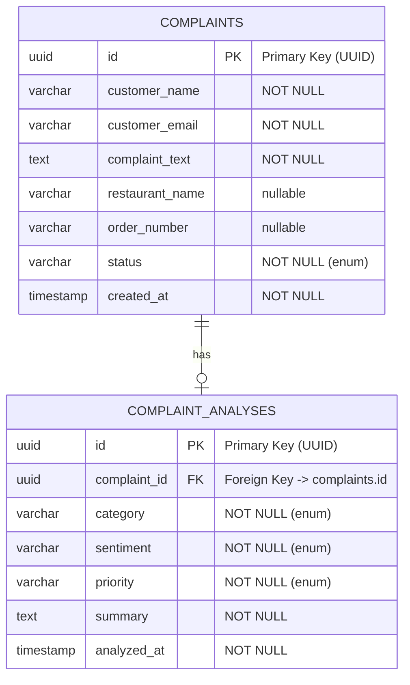

# 🐘 Database Schema — FoodSense AI

## Table of Contents

- [Overview](#-overview)
- [ER Diagram](#-er-diagram)
- [Table: complaints](#-table-complaints)
- [Table: complaint_analyses](#-table-complaint_analyses)
- [Indexes](#-indexes)
- [JPA/Hibernate Configuration](#-jpahibernate-configuration)
- [Data Types Mapping](#-data-types-mapping-java--postgresql)
- [Example Data](#-example-data)

---

## 📋 Overview

FoodSense AI uses **PostgreSQL 16** as its relational database, managed through **Spring Data JPA** with **Hibernate** as the ORM provider.

| Aspect            | Details                              |
| ----------------- | ------------------------------------ |
| **Database**      | PostgreSQL 16                        |
| **Database Name** | `foodsense`                          |
| **Schema**        | `public` (default)                   |
| **ORM**           | Hibernate 6.x (via Spring Data JPA)  |
| **DDL Strategy**  | `ddl-auto: update` (auto-migration) |
| **Tables**        | 2 (`complaints`, `complaint_analyses`) |

---

## 📊 ER Diagram



### Relationship

- **One-to-One:** Each `complaint` has **at most one** `complaint_analysis`
- **Direction:** `complaint_analyses.complaint_id` → `complaints.id`
- **Cascade:** Analysis lifecycle is managed independently (no cascade delete)

---

## 📝 Table: `complaints`

Stores all customer complaints submitted through the REST API.

### Columns

| Column           | PostgreSQL Type     | Nullable | Default         | Description                              |
| ---------------- | ------------------- | -------- | --------------- | ---------------------------------------- |
| `id`             | `UUID`              | No       | `gen_random_uuid()` | Primary key, auto-generated UUID     |
| `customer_name`  | `VARCHAR(255)`      | No       | —               | Full name of the customer                |
| `customer_email` | `VARCHAR(255)`      | No       | —               | Email address of the customer            |
| `complaint_text` | `TEXT`              | No       | —               | Full text of the complaint (unlimited)   |
| `restaurant_name`| `VARCHAR(255)`      | Yes      | `NULL`          | Name of the restaurant (optional)        |
| `order_number`   | `VARCHAR(255)`      | Yes      | `NULL`          | Order reference number (optional)        |
| `status`         | `VARCHAR(50)`       | No       | `'PENDING'`     | Processing status (enum)                 |
| `created_at`     | `TIMESTAMP`         | No       | `NOW()`         | When the complaint was submitted         |

### Constraints

| Constraint       | Type        | Details                              |
| ---------------- | ----------- | ------------------------------------ |
| `complaints_pkey`| Primary Key | `id` column                          |
| `status_check`   | Check       | `status IN ('PENDING', 'ANALYZED', 'FAILED')` |

### Status Enum Values

| Value      | Description                                |
| ---------- | ------------------------------------------ |
| `PENDING`  | Complaint submitted, awaiting AI analysis  |
| `ANALYZED` | AI analysis completed successfully         |
| `FAILED`   | AI analysis failed (Gemini error, etc.)    |

### JPA Entity

```java
@Entity
@Table(name = "complaints")
@Data
@NoArgsConstructor
@AllArgsConstructor
@Builder
public class Complaint {

    @Id
    @GeneratedValue(strategy = GenerationType.UUID)
    private UUID id;

    @Column(name = "customer_name", nullable = false)
    private String customerName;

    @Column(name = "customer_email", nullable = false)
    private String customerEmail;

    @Column(name = "complaint_text", nullable = false, columnDefinition = "TEXT")
    private String complaintText;

    @Column(name = "restaurant_name")
    private String restaurantName;

    @Column(name = "order_number")
    private String orderNumber;

    @Enumerated(EnumType.STRING)
    @Column(name = "status", nullable = false)
    private ComplaintStatus status;

    @Column(name = "created_at", nullable = false)
    private LocalDateTime createdAt;

    @PrePersist
    protected void onCreate() {
        this.createdAt = LocalDateTime.now();
        if (this.status == null) {
            this.status = ComplaintStatus.PENDING;
        }
    }
}
```

---

## 🤖 Table: `complaint_analyses`

Stores the AI-generated analysis for each complaint.

### Columns

| Column          | PostgreSQL Type     | Nullable | Default            | Description                               |
| --------------- | ------------------- | -------- | ------------------ | ----------------------------------------- |
| `id`            | `UUID`              | No       | `gen_random_uuid()`| Primary key, auto-generated UUID          |
| `complaint_id`  | `UUID`              | No       | —                  | Foreign key to `complaints.id`            |
| `category`      | `VARCHAR(50)`       | No       | —                  | Complaint category (enum)                 |
| `sentiment`     | `VARCHAR(50)`       | No       | —                  | Sentiment analysis result (enum)          |
| `priority`      | `VARCHAR(50)`       | No       | —                  | Priority level (enum)                     |
| `summary`       | `TEXT`              | No       | —                  | AI-generated summary (unlimited)          |
| `analyzed_at`   | `TIMESTAMP`         | No       | `NOW()`            | When the analysis was completed           |

### Constraints

| Constraint                   | Type         | Details                                |
| ---------------------------- | ------------ | -------------------------------------- |
| `complaint_analyses_pkey`    | Primary Key  | `id` column                            |
| `fk_complaint`               | Foreign Key  | `complaint_id` → `complaints.id`       |
| `uq_complaint_id`            | Unique       | One analysis per complaint             |
| `category_check`             | Check        | `category IN ('DELIVERY', 'FOOD_QUALITY', ...)` |
| `sentiment_check`            | Check        | `sentiment IN ('POSITIVE', 'NEGATIVE', 'NEUTRAL')` |
| `priority_check`             | Check        | `priority IN ('LOW', 'MEDIUM', 'HIGH', 'CRITICAL')` |

### Enum Values

#### `category` — `ComplaintCategory`

| Value              | Description                                              |
| ------------------ | -------------------------------------------------------- |
| `DELIVERY`         | Late delivery, missing items, wrong address, driver issues |
| `FOOD_QUALITY`     | Cold food, wrong order, contamination, taste, packaging  |
| `CUSTOMER_SERVICE` | Rude staff, unresponsive support, refund issues          |
| `BILLING`          | Overcharges, double billing, promo code issues           |
| `APP_ISSUE`        | App crashes, payment failures, tracking problems         |
| `OTHER`            | Anything not fitting the above categories                |

#### `sentiment` — `SentimentType`

| Value      | Description                              |
| ---------- | ---------------------------------------- |
| `POSITIVE` | Customer expresses satisfaction or praise |
| `NEGATIVE` | Customer expresses dissatisfaction, anger |
| `NEUTRAL`  | Factual report without strong emotion     |

#### `priority` — `PriorityLevel`

| Value      | Description                                          |
| ---------- | ---------------------------------------------------- |
| `LOW`      | Minor inconvenience, suggestion, general feedback    |
| `MEDIUM`   | Moderate issue, slightly late delivery, minor error  |
| `HIGH`     | Major issue, very late delivery, completely wrong order |
| `CRITICAL` | Health/safety concern, allergic reaction, food poisoning |

### JPA Entity

```java
@Entity
@Table(name = "complaint_analyses")
@Data
@NoArgsConstructor
@AllArgsConstructor
@Builder
public class ComplaintAnalysis {

    @Id
    @GeneratedValue(strategy = GenerationType.UUID)
    private UUID id;

    @OneToOne
    @JoinColumn(name = "complaint_id", nullable = false, unique = true)
    private Complaint complaint;

    @Enumerated(EnumType.STRING)
    @Column(name = "category", nullable = false)
    private ComplaintCategory category;

    @Enumerated(EnumType.STRING)
    @Column(name = "sentiment", nullable = false)
    private SentimentType sentiment;

    @Enumerated(EnumType.STRING)
    @Column(name = "priority", nullable = false)
    private PriorityLevel priority;

    @Column(name = "summary", nullable = false, columnDefinition = "TEXT")
    private String summary;

    @Column(name = "analyzed_at", nullable = false)
    private LocalDateTime analyzedAt;

    @PrePersist
    protected void onAnalyze() {
        this.analyzedAt = LocalDateTime.now();
    }
}
```

---

## 📇 Indexes

### Automatically Created Indexes

| Index Name                           | Table                 | Column(s)       | Type    | Created By     |
| ------------------------------------ | --------------------- | --------------- | ------- | -------------- |
| `complaints_pkey`                    | `complaints`          | `id`            | Primary | JPA            |
| `complaint_analyses_pkey`            | `complaint_analyses`  | `id`            | Primary | JPA            |
| `uq_complaint_id`                    | `complaint_analyses`  | `complaint_id`  | Unique  | JPA (`unique = true`) |

### Recommended Additional Indexes (Future)

| Index                                | Table                 | Column(s)       | Purpose                          |
| ------------------------------------ | --------------------- | --------------- | -------------------------------- |
| `idx_complaints_status`              | `complaints`          | `status`        | Filter by processing status      |
| `idx_complaints_created_at`          | `complaints`          | `created_at`    | Sort/filter by submission date   |
| `idx_complaints_restaurant`          | `complaints`          | `restaurant_name` | Filter by restaurant           |
| `idx_analyses_category`              | `complaint_analyses`  | `category`      | Filter by complaint category     |
| `idx_analyses_priority`              | `complaint_analyses`  | `priority`      | Filter by priority level         |
| `idx_analyses_analyzed_at`           | `complaint_analyses`  | `analyzed_at`   | Sort/filter by analysis date     |

```sql
-- Example: Creating recommended indexes
CREATE INDEX idx_complaints_status ON complaints(status);
CREATE INDEX idx_complaints_created_at ON complaints(created_at DESC);
CREATE INDEX idx_complaints_restaurant ON complaints(restaurant_name);
CREATE INDEX idx_analyses_category ON complaint_analyses(category);
CREATE INDEX idx_analyses_priority ON complaint_analyses(priority);
CREATE INDEX idx_analyses_analyzed_at ON complaint_analyses(analyzed_at DESC);
```

> [!TIP]
> For development with small datasets, these additional indexes aren't necessary. Add them when query performance becomes a concern in production.

---

## ⚙️ JPA/Hibernate Configuration

### Application Configuration

```yaml
# application.yml
spring:
  datasource:
    url: jdbc:postgresql://${DB_HOST:localhost}:${DB_PORT:5432}/${POSTGRES_DB:foodsense}
    username: ${POSTGRES_USER:postgres}
    password: ${POSTGRES_PASSWORD:postgres}
    driver-class-name: org.postgresql.Driver

  jpa:
    hibernate:
      ddl-auto: update       # Auto-create and update tables
    show-sql: true           # Log SQL queries (dev only)
    properties:
      hibernate:
        dialect: org.hibernate.dialect.PostgreSQLDialect
        format_sql: true     # Pretty-print SQL in logs
```

### DDL Auto Strategy

| Strategy       | Behavior                                              | Use Case             |
| -------------- | ----------------------------------------------------- | -------------------- |
| `none`         | No schema management                                  | Production           |
| `validate`     | Validates schema matches entities (no changes)        | CI/CD                |
| `update` ✅    | Creates/alters tables to match entities               | Development          |
| `create`       | Drops and recreates tables on startup                 | Testing              |
| `create-drop`  | Creates on startup, drops on shutdown                 | Unit tests           |

> [!WARNING]
> **`ddl-auto: update` is for development only.** In production, use database migration tools like **Flyway** or **Liquibase** to manage schema changes safely.

### UUID Generation Strategy

```java
@Id
@GeneratedValue(strategy = GenerationType.UUID)
private UUID id;
```

- Hibernate 6+ natively supports `GenerationType.UUID`
- Generates **UUID v4** (random) identifiers
- PostgreSQL stores UUIDs as the native `UUID` type (16 bytes, not 36-char string)

---

## 🔄 Data Types Mapping (Java → PostgreSQL)

| Java Type                  | PostgreSQL Type      | Notes                                  |
| -------------------------- | -------------------- | -------------------------------------- |
| `UUID`                     | `UUID`               | Native UUID type (16 bytes)            |
| `String`                   | `VARCHAR(255)`       | Default string mapping                 |
| `String` (`columnDefinition = "TEXT"`) | `TEXT`  | Unlimited length text                  |
| `LocalDateTime`            | `TIMESTAMP`          | Without timezone                       |
| `Enum` (`EnumType.STRING`) | `VARCHAR(50)`        | Stored as string name, not ordinal     |
| `boolean`                  | `BOOLEAN`            | true/false                             |
| `int` / `Integer`          | `INTEGER`            | 4-byte integer                         |
| `long` / `Long`            | `BIGINT`             | 8-byte integer                         |
| `double` / `Double`        | `DOUBLE PRECISION`   | 8-byte floating point                  |
| `BigDecimal`               | `NUMERIC`            | Exact decimal (for money)              |

### Why `EnumType.STRING` over `EnumType.ORDINAL`?

```java
// ✅ STRING — Stored as "DELIVERY", "FOOD_QUALITY", etc.
@Enumerated(EnumType.STRING)
private ComplaintCategory category;

// ❌ ORDINAL — Stored as 0, 1, 2, etc. (fragile!)
@Enumerated(EnumType.ORDINAL)
private ComplaintCategory category;
```

| Aspect          | `EnumType.ORDINAL`            | `EnumType.STRING` ✅               |
| --------------- | ----------------------------- | ---------------------------------- |
| **Storage**     | Integer (0, 1, 2...)          | String ("DELIVERY", "HIGH"...)     |
| **Readability** | Must know enum order          | Self-documenting in DB             |
| **Safety**      | Breaks if enum order changes  | Safe even if order changes         |
| **Size**        | Smaller (4 bytes)             | Larger (variable, but negligible)  |

---

## 📊 Example Data

### `complaints` Table

| id | customer_name | customer_email | complaint_text | restaurant_name | order_number | status | created_at |
| --- | --- | --- | --- | --- | --- | --- | --- |
| `f5e6d7c8-9a0b-1c2d-3e4f-567890abcdef` | Jane Smith | jane.smith@email.com | I ordered a pizza from PizzaHut via your app and it arrived 2 hours late. The food was cold and the delivery driver was rude. I want a full refund. | PizzaHut | ORD-2026-78432 | ANALYZED | 2026-05-30 17:00:00 |
| `b2c3d4e5-f6a7-8901-bcde-f23456789012` | John Doe | john.doe@email.com | The burger I received was completely wrong. I ordered a veggie burger but got a chicken burger instead. I'm vegetarian! | BurgerKing | ORD-2026-10234 | ANALYZED | 2026-05-30 16:30:00 |
| `d4e5f6a7-b8c9-0123-defg-456789012345` | Alice Johnson | alice.j@email.com | I was charged twice for my order. The app showed payment failed so I tried again, but both charges went through. | Subway | ORD-2026-55678 | PENDING | 2026-05-30 16:45:00 |

### `complaint_analyses` Table

| id | complaint_id | category | sentiment | priority | summary | analyzed_at |
| --- | --- | --- | --- | --- | --- | --- |
| `a1b2c3d4-e5f6-7890-abcd-ef1234567890` | `f5e6d7c8-9a0b-...` | DELIVERY | NEGATIVE | HIGH | Customer reports a 2-hour delivery delay with cold food and rude driver behavior. Requests full refund. | 2026-05-30 17:00:05 |
| `c3d4e5f6-a7b8-9012-cdef-345678901234` | `b2c3d4e5-f6a7-...` | FOOD_QUALITY | NEGATIVE | HIGH | Incorrect order delivered — customer received chicken burger instead of requested veggie burger. Customer is vegetarian, potential dietary concern. | 2026-05-30 16:30:04 |

### SQL to Insert Example Data

```sql
-- Insert example complaints
INSERT INTO complaints (id, customer_name, customer_email, complaint_text, restaurant_name, order_number, status, created_at)
VALUES
  ('f5e6d7c8-9a0b-1c2d-3e4f-567890abcdef', 'Jane Smith', 'jane.smith@email.com',
   'I ordered a pizza from PizzaHut via your app and it arrived 2 hours late. The food was cold and the delivery driver was rude. I want a full refund.',
   'PizzaHut', 'ORD-2026-78432', 'ANALYZED', '2026-05-30 17:00:00'),

  ('b2c3d4e5-f6a7-8901-bcde-f23456789012', 'John Doe', 'john.doe@email.com',
   'The burger I received was completely wrong. I ordered a veggie burger but got a chicken burger instead. I''m vegetarian!',
   'BurgerKing', 'ORD-2026-10234', 'ANALYZED', '2026-05-30 16:30:00');

-- Insert example analyses
INSERT INTO complaint_analyses (id, complaint_id, category, sentiment, priority, summary, analyzed_at)
VALUES
  ('a1b2c3d4-e5f6-7890-abcd-ef1234567890', 'f5e6d7c8-9a0b-1c2d-3e4f-567890abcdef',
   'DELIVERY', 'NEGATIVE', 'HIGH',
   'Customer reports a 2-hour delivery delay with cold food and rude driver behavior. Requests full refund.',
   '2026-05-30 17:00:05'),

  ('c3d4e5f6-a7b8-9012-cdef-345678901234', 'b2c3d4e5-f6a7-8901-bcde-f23456789012',
   'FOOD_QUALITY', 'NEGATIVE', 'HIGH',
   'Incorrect order delivered — customer received chicken burger instead of requested veggie burger. Customer is vegetarian, potential dietary concern.',
   '2026-05-30 16:30:04');
```

---

## 📚 Further Reading

- [Architecture Guide](ARCHITECTURE.md) — How the persistence layer fits into the system
- [API Documentation](API_DOCUMENTATION.md) — How data is exposed via REST APIs
- [Setup Guide](SETUP_GUIDE.md) — PostgreSQL Docker setup instructions
