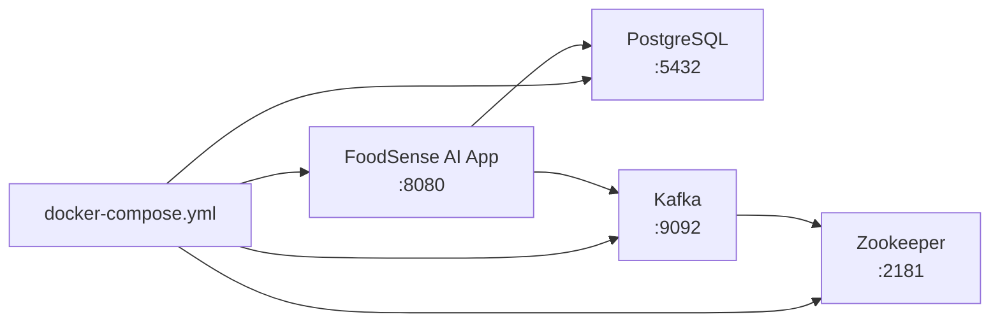
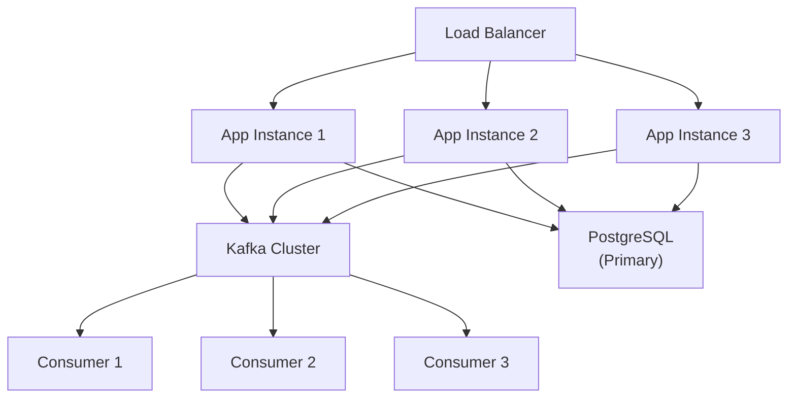

# 🚀 Deployment Guide

## Overview

FoodSense AI can be deployed using Docker Compose for development/staging, or individually configured for production environments.

---

## Docker Compose Deployment

### Prerequisites
- Docker Engine 20.10+
- Docker Compose v2.0+
- At least 4GB RAM available

### Services



| Service | Image | Port | Purpose |
|---------|-------|------|---------|
| `postgres` | `postgres:16-alpine` | 5432 | Primary database |
| `zookeeper` | `confluentinc/cp-zookeeper:7.6.0` | 2181 | Kafka coordination |
| `kafka` | `confluentinc/cp-kafka:7.6.0` | 9092 | Message broker |
| `app` | Built from `Dockerfile` | 8080 | Spring Boot application |

### Step-by-Step Deployment

#### 1. Configure Environment

```bash
# Copy and edit environment file
cp .env.example .env

# Set your Gemini API key
# Edit .env and replace 'your-gemini-api-key-here' with your actual key
```

#### 2. Start All Services

```bash
# Build and start all services
docker-compose up -d --build

# View logs
docker-compose logs -f app

# Check service health
docker-compose ps
```

#### 3. Verify Deployment

```bash
# Check application health
curl http://localhost:8080/swagger-ui.html

# Submit a test complaint
curl -X POST http://localhost:8080/api/complaints \
  -H "Content-Type: application/json" \
  -d '{
    "customerName": "Test User",
    "complaintText": "The delivery was 2 hours late and the food arrived cold."
  }'
```

#### 4. Stop Services

```bash
# Stop all services
docker-compose down

# Stop and remove volumes (WARNING: deletes data)
docker-compose down -v
```

---

## Environment Variables

| Variable | Default | Required | Description |
|----------|---------|----------|-------------|
| `GEMINI_API_KEY` | — | ✅ Yes | Google Gemini API key |
| `SPRING_PROFILES_ACTIVE` | `docker` | No | Active Spring profile |
| `SPRING_DATASOURCE_URL` | `jdbc:postgresql://postgres:5432/foodsense_db` | No | Database URL |
| `SPRING_DATASOURCE_USERNAME` | `foodsense` | No | Database username |
| `SPRING_DATASOURCE_PASSWORD` | `foodsense_secret` | No | Database password |
| `SPRING_KAFKA_BOOTSTRAP_SERVERS` | `kafka:29092` | No | Kafka bootstrap servers |

---

## Health Checks

### Application Health
The Dockerfile includes a built-in health check:
```dockerfile
HEALTHCHECK --interval=30s --timeout=10s --retries=3 --start-period=40s \
    CMD wget -qO- http://localhost:8080/actuator/health || exit 1
```

### PostgreSQL Health
```bash
docker exec foodsense-postgres pg_isready -U foodsense -d foodsense_db
```

### Kafka Health
```bash
docker exec foodsense-kafka kafka-broker-api-versions --bootstrap-server localhost:9092
```

---

## Production Considerations

### Security
- [ ] Use environment-specific secrets management (Vault, AWS Secrets Manager)
- [ ] Enable HTTPS/TLS termination via reverse proxy (Nginx, Traefik)
- [ ] Add Spring Security with JWT authentication
- [ ] Restrict Swagger UI access in production
- [ ] Use non-root database users with minimal privileges

### Database
- [ ] Change `ddl-auto` from `update` to `validate` in production
- [ ] Use Flyway or Liquibase for database migrations
- [ ] Configure connection pooling (HikariCP is default)
- [ ] Set up database backups and replication

### Kafka
- [ ] Increase replication factor to 3 for fault tolerance
- [ ] Configure proper partition count based on throughput needs
- [ ] Implement dead letter queue for failed messages
- [ ] Enable Kafka SSL/SASL authentication

### Application
- [ ] Configure proper JVM memory settings (`-Xms`, `-Xmx`)
- [ ] Enable Spring Boot Actuator metrics
- [ ] Set up structured JSON logging
- [ ] Configure graceful shutdown

---

## Scaling Strategies

### Horizontal Scaling



- **Application**: Run multiple instances behind a load balancer
- **Kafka Consumers**: Increase partitions and consumer instances (max consumers = partitions)
- **Database**: Read replicas for GET endpoints, connection pooling

### Vertical Scaling
- Increase container resource limits in `docker-compose.yml`
- Optimize JVM heap settings

---

## Monitoring Suggestions

### Prometheus + Grafana (Recommended)

1. Add Spring Boot Actuator Prometheus endpoint:
```yaml
management:
  endpoints:
    web:
      exposure:
        include: health,info,prometheus,metrics
  metrics:
    export:
      prometheus:
        enabled: true
```

2. Add Prometheus and Grafana to `docker-compose.yml`

### Key Metrics to Monitor
| Metric | Description |
|--------|-------------|
| `http_server_requests_seconds` | API response times |
| `jvm_memory_used_bytes` | JVM memory usage |
| `kafka_consumer_records_consumed_total` | Kafka consumption rate |
| `hikaricp_connections_active` | Active DB connections |
| Custom: `complaints_submitted_total` | Total complaints submitted |
| Custom: `analyses_completed_total` | Total analyses completed |

---

## CI/CD Pipeline (GitHub Actions Example)

```yaml
name: FoodSense AI CI/CD

on:
  push:
    branches: [main, develop]
  pull_request:
    branches: [main]

jobs:
  test:
    runs-on: ubuntu-latest
    steps:
      - uses: actions/checkout@v4
      - uses: actions/setup-java@v4
        with:
          java-version: '21'
          distribution: 'temurin'
      - name: Run Tests
        run: mvn clean test

  build:
    needs: test
    runs-on: ubuntu-latest
    if: github.ref == 'refs/heads/main'
    steps:
      - uses: actions/checkout@v4
      - uses: actions/setup-java@v4
        with:
          java-version: '21'
          distribution: 'temurin'
      - name: Build JAR
        run: mvn clean package -DskipTests
      - name: Build Docker Image
        run: docker build -t foodsense-ai:latest .
      - name: Push to Registry
        run: |
          docker tag foodsense-ai:latest $REGISTRY/foodsense-ai:latest
          docker push $REGISTRY/foodsense-ai:latest

  deploy:
    needs: build
    runs-on: ubuntu-latest
    if: github.ref == 'refs/heads/main'
    steps:
      - name: Deploy to Server
        run: |
          ssh $SERVER "cd /app && docker-compose pull && docker-compose up -d"
```

---

## Troubleshooting

### Common Issues

| Issue | Solution |
|-------|----------|
| Port 5432 already in use | Stop local PostgreSQL or change port in `docker-compose.yml` |
| Kafka connection refused | Wait for Kafka to fully start (~30s after Zookeeper) |
| Gemini API 403 | Verify `GEMINI_API_KEY` in `.env` |
| Out of memory | Increase Docker Desktop memory allocation |
| App fails to connect to Kafka | Ensure `kafka` service is healthy: `docker-compose ps` |
