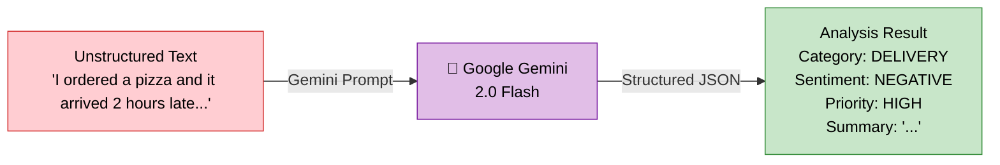
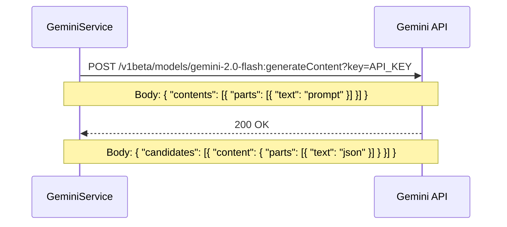
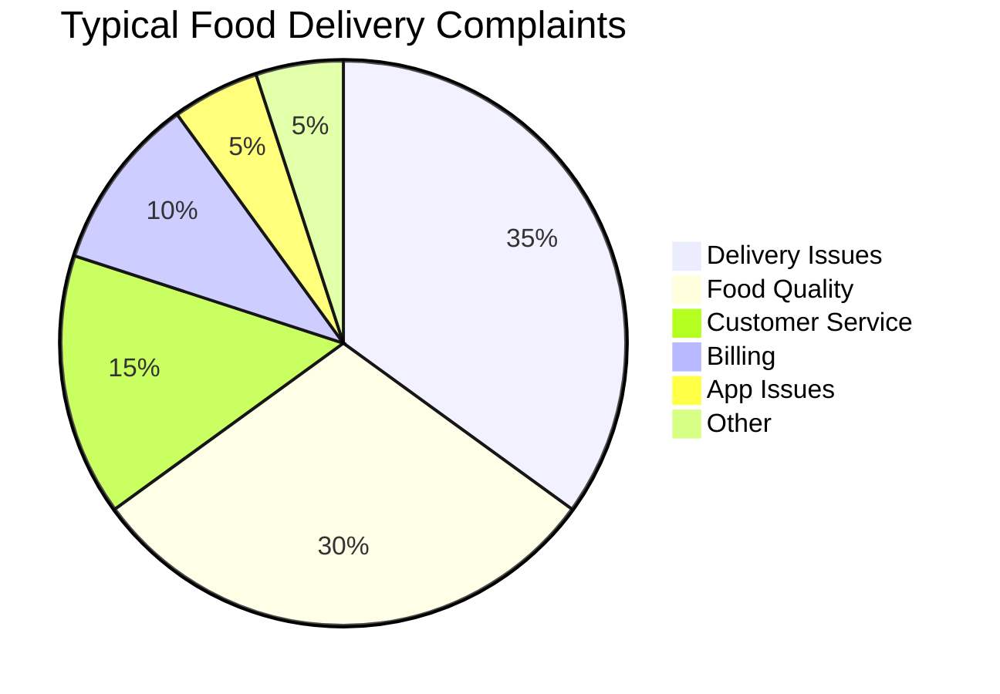
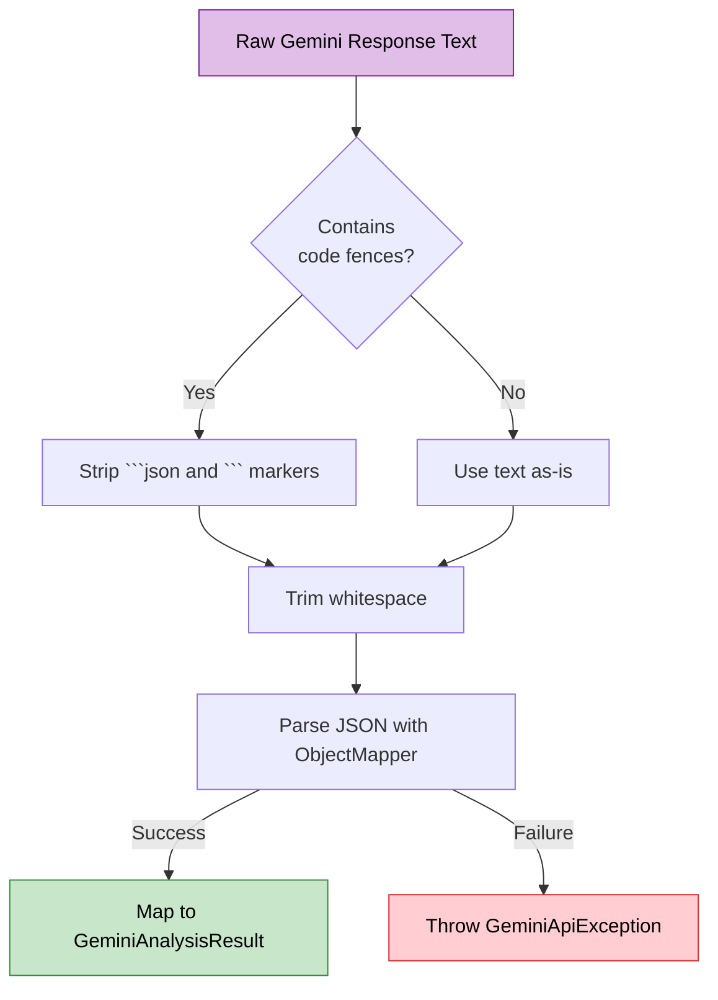
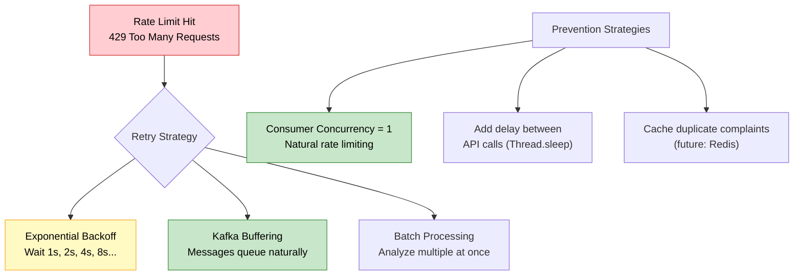

# 🤖 Gemini Integration — FoodSense AI

## Table of Contents

- [Overview](#-overview)
- [API Endpoint](#-api-endpoint)
- [Authentication](#-authentication)
- [Prompt Engineering](#-prompt-engineering)
- [Request/Response Format](#-requestresponse-format)
- [Response Parsing](#-response-parsing)
- [Error Handling](#-error-handling)
- [Rate Limiting](#-rate-limiting-considerations)
- [Example API Call](#-example-api-call)
- [Configuration Properties](#-configuration-properties)

---

## 📋 Overview

FoodSense AI uses **Google Gemini 2.0 Flash** to analyze customer complaints. Gemini is a **Large Language Model (LLM)** that understands natural language and can extract structured information from unstructured text.

### What Does Gemini Do in This System?



### Why Gemini 2.0 Flash?

| Model               | Speed    | Cost       | Quality    | Best For                    |
| -------------------- | -------- | ---------- | ---------- | --------------------------- |
| Gemini 2.0 Flash ✅  | ⚡ Fast  | 💰 Cheap   | ⭐ Good    | Structured extraction tasks |
| Gemini 2.5 Pro       | 🐌 Slow  | 💰💰 More  | ⭐⭐ Best  | Complex reasoning tasks     |

We chose **Gemini 2.0 Flash** because:
- **Speed:** Responds in 1-3 seconds (important for near-real-time processing)
- **Cost:** Very affordable — free tier includes 15 RPM / 1,500 RPD
- **Sufficient quality:** Complaint categorization doesn't require deep reasoning
- **Reliability:** Flash models have higher availability and lower latency

---

## 🌐 API Endpoint

### Endpoint Details

| Property      | Value                                                                              |
| ------------- | ---------------------------------------------------------------------------------- |
| **Base URL**  | `https://generativelanguage.googleapis.com`                                        |
| **Path**      | `/v1beta/models/gemini-2.0-flash:generateContent`                                 |
| **Method**    | `POST`                                                                             |
| **Full URL**  | `https://generativelanguage.googleapis.com/v1beta/models/gemini-2.0-flash:generateContent?key={API_KEY}` |

### Request Flow



---

## 🔑 Authentication

The Gemini API uses **API key authentication** passed as a query parameter.

| Method          | Details                                |
| --------------- | -------------------------------------- |
| **Auth Type**   | API Key (query parameter)              |
| **Parameter**   | `key`                                  |
| **Example**     | `?key=AIzaSyB1234567890abcdefgh`       |
| **Env Variable**| `GEMINI_API_KEY`                       |

### Getting an API Key

1. Navigate to [Google AI Studio](https://aistudio.google.com/apikey)
2. Sign in with your Google account
3. Click **"Create API Key"**
4. Copy the generated key
5. Set it as the `GEMINI_API_KEY` environment variable

> [!CAUTION]
> **Never hardcode the API key** in source code or commit it to version control. Always use environment variables or a secrets manager.

```java
// ❌ NEVER do this
private static final String API_KEY = "AIzaSyB1234567890";

// ✅ Always use environment variables
@Value("${gemini.api.key}")
private String apiKey;
```

---

## 🧠 Prompt Engineering

### The Prompt Template

The prompt is carefully crafted to instruct Gemini to return a **consistent, structured JSON response**. This is the exact prompt template used:

```text
You are an expert customer service analyst for a food delivery platform.
Analyze the following customer complaint and extract structured information.

COMPLAINT:
"{complaintText}"

Analyze the complaint and respond with ONLY a valid JSON object (no markdown, no explanation, no code fences) with these exact fields:

{
  "category": "one of: DELIVERY, FOOD_QUALITY, CUSTOMER_SERVICE, BILLING, APP_ISSUE, OTHER",
  "sentiment": "one of: POSITIVE, NEGATIVE, NEUTRAL",
  "priority": "one of: LOW, MEDIUM, HIGH, CRITICAL",
  "summary": "A concise 1-2 sentence summary of the complaint"
}

Rules for classification:
- DELIVERY: Late delivery, missing items, wrong address, delivery driver issues
- FOOD_QUALITY: Cold food, wrong order, contamination, taste issues, packaging
- CUSTOMER_SERVICE: Rude staff, unresponsive support, refund issues
- BILLING: Overcharges, double billing, promo code issues, refund not received
- APP_ISSUE: App crashes, payment failures, tracking problems, UI bugs
- OTHER: Anything that doesn't fit the above categories

Priority guidelines:
- CRITICAL: Health/safety concerns, allergic reactions, food poisoning
- HIGH: Major issues affecting order (very late delivery, completely wrong order, rude behavior)
- MEDIUM: Moderate issues (slightly late, minor missing items, minor quality issues)
- LOW: Minor inconveniences, suggestions, general feedback

Respond with ONLY the JSON object. No other text.
```

### Prompt Engineering Decisions

| Decision                         | Rationale                                                   |
| -------------------------------- | ----------------------------------------------------------- |
| **"ONLY a valid JSON object"**   | Prevents Gemini from adding explanations around the JSON    |
| **"no markdown, no code fences"**| Gemini often wraps JSON in ```json``` blocks — this stops it |
| **Exact enum values listed**     | Ensures consistent values that map to Java enums            |
| **Classification rules**         | Reduces ambiguity — each category has clear examples        |
| **Priority guidelines**          | Ensures severity is assessed consistently                   |
| **"1-2 sentence summary"**       | Keeps summaries concise and actionable                      |

> [!TIP]
> **Prompt engineering tip:** LLMs follow instructions better when you give them a **role** ("You are an expert..."), **explicit constraints** ("ONLY a valid JSON"), and **examples** of expected output.

### Why These Categories?



The categories were chosen based on common food delivery platform complaint patterns. They cover 95%+ of real-world complaints.

---

## 📨 Request/Response Format

### Request to Gemini API

```json
{
  "contents": [
    {
      "parts": [
        {
          "text": "You are an expert customer service analyst for a food delivery platform.\nAnalyze the following customer complaint...\n\nCOMPLAINT:\n\"I ordered a pizza from PizzaHut via your app and it arrived 2 hours late. The food was cold and the delivery driver was rude. I want a full refund.\"\n\nAnalyze the complaint and respond with ONLY a valid JSON object..."
        }
      ]
    }
  ]
}
```

### Response from Gemini API

```json
{
  "candidates": [
    {
      "content": {
        "parts": [
          {
            "text": "{\n  \"category\": \"DELIVERY\",\n  \"sentiment\": \"NEGATIVE\",\n  \"priority\": \"HIGH\",\n  \"summary\": \"Customer reports a 2-hour delivery delay with cold food and rude driver behavior. Requests full refund.\"\n}"
          }
        ],
        "role": "model"
      },
      "finishReason": "STOP",
      "avgLogprobs": -0.0123
    }
  ],
  "usageMetadata": {
    "promptTokenCount": 245,
    "candidatesTokenCount": 52,
    "totalTokenCount": 297
  },
  "modelVersion": "gemini-2.0-flash"
}
```

### Response Navigation Path

```
response
  └── candidates[0]
        └── content
              └── parts[0]
                    └── text  ← This is the JSON string we need
```

---

## 🔍 Response Parsing

### The Parsing Challenge

Even though our prompt says "no markdown, no code fences," Gemini **sometimes** wraps the JSON in markdown code blocks:

```
```json
{
  "category": "DELIVERY",
  "sentiment": "NEGATIVE",
  "priority": "HIGH",
  "summary": "..."
}
```　
```

### Parsing Strategy

The `GeminiService` handles this with a robust parsing pipeline:



### Parsing Code

```java
private String extractJsonFromResponse(String responseText) {
    String text = responseText.trim();

    // Handle markdown code fences: ```json ... ``` or ``` ... ```
    if (text.startsWith("```")) {
        // Remove opening fence (```json or ```)
        int firstNewline = text.indexOf('\n');
        if (firstNewline != -1) {
            text = text.substring(firstNewline + 1);
        }

        // Remove closing fence
        int lastFence = text.lastIndexOf("```");
        if (lastFence != -1) {
            text = text.substring(0, lastFence);
        }

        text = text.trim();
    }

    return text;
}

private GeminiAnalysisResult parseAnalysisJson(String jsonString) {
    try {
        ObjectMapper mapper = new ObjectMapper();
        return mapper.readValue(jsonString, GeminiAnalysisResult.class);
    } catch (JsonProcessingException e) {
        throw new GeminiApiException("Failed to parse Gemini response: " + e.getMessage());
    }
}
```

### GeminiAnalysisResult DTO

```java
@Data
@NoArgsConstructor
@AllArgsConstructor
public class GeminiAnalysisResult {
    private ComplaintCategory category;
    private SentimentType sentiment;
    private PriorityLevel priority;
    private String summary;
}
```

---

## 🛡️ Error Handling

### Error Types and Handling

| Error Scenario             | HTTP Status | Handling                                |
| -------------------------- | ----------- | --------------------------------------- |
| **Invalid API key**        | 401         | Throw `GeminiApiException`, log error   |
| **Rate limit exceeded**    | 429         | Throw `GeminiApiException`, log warning |
| **Model overloaded**       | 503         | Throw `GeminiApiException`, log warning |
| **Invalid response JSON**  | 200         | Throw `GeminiApiException`, log error   |
| **Network timeout**        | —           | Throw `GeminiApiException`, log error   |
| **Empty response**         | 200         | Throw `GeminiApiException`, log error   |

### Error Handling Code

```java
@Service
@Slf4j
public class GeminiService {

    public GeminiAnalysisResult analyzeComplaint(String complaintText) {
        try {
            // Build request
            Map<String, Object> requestBody = buildRequestBody(complaintText);

            // Call Gemini API
            String url = apiUrl + "?key=" + apiKey;
            ResponseEntity<Map> response = restTemplate.postForEntity(
                url, requestBody, Map.class);

            // Validate response
            if (response.getBody() == null) {
                throw new GeminiApiException("Empty response from Gemini API");
            }

            // Extract and parse text
            String responseText = extractTextFromResponse(response.getBody());
            String jsonString = extractJsonFromResponse(responseText);
            return parseAnalysisJson(jsonString);

        } catch (HttpClientErrorException e) {
            log.error("Gemini API client error: {} - {}",
                e.getStatusCode(), e.getResponseBodyAsString());
            throw new GeminiApiException("Gemini API error: " + e.getMessage());

        } catch (HttpServerErrorException e) {
            log.error("Gemini API server error: {} - {}",
                e.getStatusCode(), e.getResponseBodyAsString());
            throw new GeminiApiException("Gemini API unavailable: " + e.getMessage());

        } catch (ResourceAccessException e) {
            log.error("Gemini API connection error: {}", e.getMessage());
            throw new GeminiApiException("Cannot connect to Gemini API: " + e.getMessage());
        }
    }
}
```

---

## ⏱️ Rate Limiting Considerations

### Gemini API Rate Limits (Free Tier)

| Limit Type                | Value                   |
| ------------------------- | ----------------------- |
| **Requests per minute**   | 15 RPM                  |
| **Requests per day**      | 1,500 RPD               |
| **Tokens per minute**     | 1,000,000 TPM           |

### Impact on FoodSense AI

| Scenario                    | Complaints per Day | Within Free Tier? |
| --------------------------- | ------------------- | ----------------- |
| **Development/Testing**     | 10-50               | ✅ Yes             |
| **Small demo**              | 100-500             | ✅ Yes             |
| **Medium workload**         | 1,000-1,500         | ⚠️ At limit        |
| **Production workload**     | 5,000+              | ❌ Need paid tier   |

### Rate Limit Mitigation Strategies



> [!NOTE]
> Kafka naturally helps with rate limiting because the consumer processes messages **sequentially**. With 1 partition and 1 consumer, you never exceed 1 concurrent request to Gemini. The messages simply queue up if Gemini is slow or rate-limited.

---

## 💡 Example API Call

### Complete Example: Java Service Call

```java
// 1. Build the prompt
String prompt = String.format("""
    You are an expert customer service analyst...
    COMPLAINT:
    "%s"
    Analyze the complaint and respond with ONLY a valid JSON object...
    """, complaintText);

// 2. Build the request body
Map<String, Object> part = Map.of("text", prompt);
Map<String, Object> content = Map.of("parts", List.of(part));
Map<String, Object> requestBody = Map.of("contents", List.of(content));

// 3. Call the API
String url = "https://generativelanguage.googleapis.com/v1beta/models/gemini-2.0-flash:generateContent?key=" + apiKey;
ResponseEntity<Map> response = restTemplate.postForEntity(url, requestBody, Map.class);

// 4. Extract the result text
Map responseBody = response.getBody();
List<Map> candidates = (List<Map>) responseBody.get("candidates");
Map content = (Map) candidates.get(0).get("content");
List<Map> parts = (List<Map>) content.get("parts");
String resultText = (String) parts.get(0).get("text");

// 5. Parse JSON
GeminiAnalysisResult result = objectMapper.readValue(resultText, GeminiAnalysisResult.class);
```

### Example with `curl` (for testing)

```bash
curl -X POST "https://generativelanguage.googleapis.com/v1beta/models/gemini-2.0-flash:generateContent?key=YOUR_API_KEY" \
  -H "Content-Type: application/json" \
  -d '{
    "contents": [
      {
        "parts": [
          {
            "text": "You are an expert customer service analyst for a food delivery platform.\nAnalyze the following customer complaint and extract structured information.\n\nCOMPLAINT:\n\"I ordered a pizza from PizzaHut via your app and it arrived 2 hours late. The food was cold and the delivery driver was rude. I want a full refund.\"\n\nAnalyze the complaint and respond with ONLY a valid JSON object (no markdown, no explanation, no code fences) with these exact fields:\n\n{\n  \"category\": \"one of: DELIVERY, FOOD_QUALITY, CUSTOMER_SERVICE, BILLING, APP_ISSUE, OTHER\",\n  \"sentiment\": \"one of: POSITIVE, NEGATIVE, NEUTRAL\",\n  \"priority\": \"one of: LOW, MEDIUM, HIGH, CRITICAL\",\n  \"summary\": \"A concise 1-2 sentence summary of the complaint\"\n}\n\nRespond with ONLY the JSON object. No other text."
          }
        ]
      }
    ]
  }'
```

### Expected Response

```json
{
  "category": "DELIVERY",
  "sentiment": "NEGATIVE",
  "priority": "HIGH",
  "summary": "Customer reports a 2-hour delivery delay with cold food and rude driver behavior. Requests full refund."
}
```

---

## ⚙️ Configuration Properties

### Application Configuration

```yaml
# application.yml
gemini:
  api:
    key: ${GEMINI_API_KEY}
    url: https://generativelanguage.googleapis.com/v1beta/models/gemini-2.0-flash:generateContent
    timeout: 30000  # 30 seconds
```

### GeminiConfig Bean

```java
@Configuration
public class GeminiConfig {

    @Value("${gemini.api.key}")
    private String apiKey;

    @Value("${gemini.api.url}")
    private String apiUrl;

    @Value("${gemini.api.timeout:30000}")
    private int timeout;

    @Bean
    public RestTemplate geminiRestTemplate() {
        SimpleClientHttpRequestFactory factory = new SimpleClientHttpRequestFactory();
        factory.setConnectTimeout(timeout);
        factory.setReadTimeout(timeout);
        return new RestTemplate(factory);
    }
}
```

### Configuration Property Reference

| Property            | Default    | Description                               |
| ------------------- | ---------- | ----------------------------------------- |
| `gemini.api.key`    | —          | Google Gemini API key (required)          |
| `gemini.api.url`    | See above  | Gemini generateContent endpoint URL       |
| `gemini.api.timeout`| `30000`    | HTTP connection and read timeout (ms)     |

---

## 📚 Further Reading

- [Kafka Flow](KAFKA_FLOW.md) — How messages reach the Gemini integration
- [Architecture Guide](ARCHITECTURE.md) — Where Gemini fits in the system
- [Database Schema](DATABASE_SCHEMA.md) — How analysis results are stored
- [Google Gemini API Docs](https://ai.google.dev/gemini-api/docs) — Official documentation
