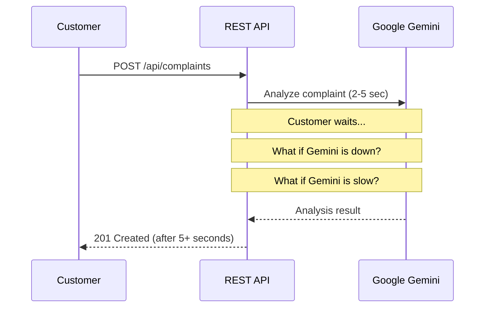
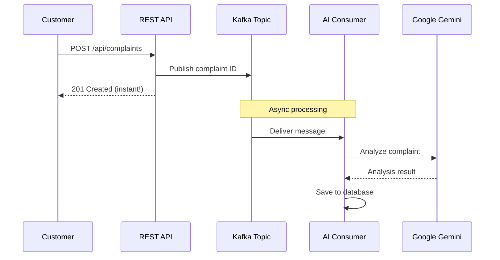
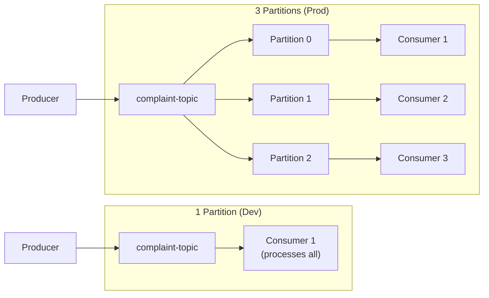
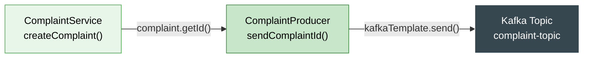
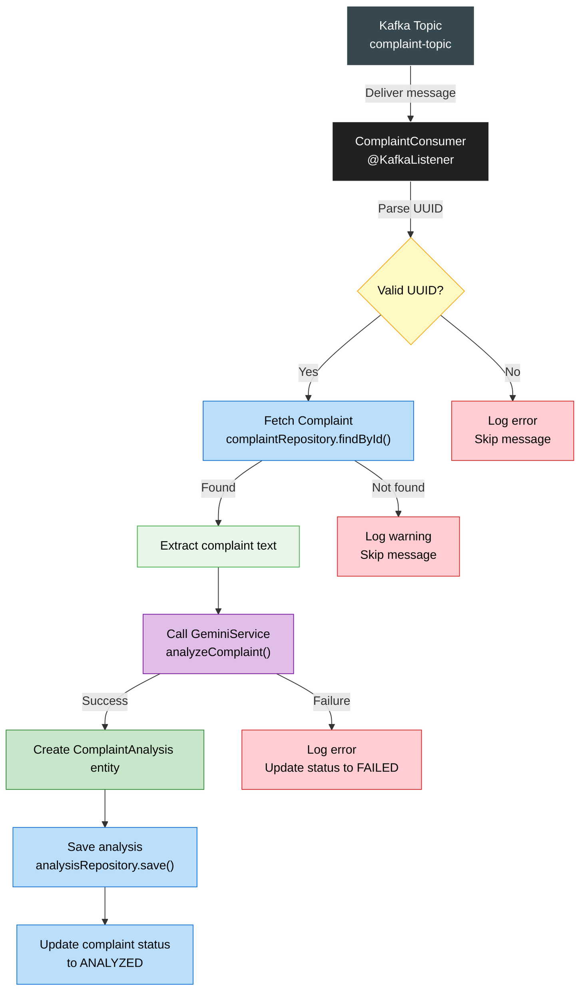
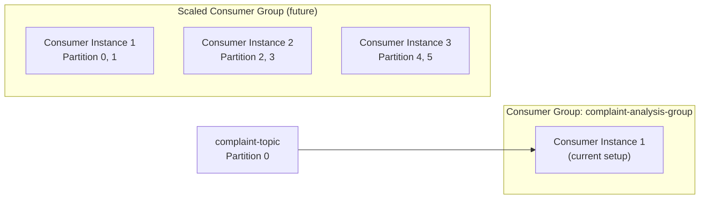
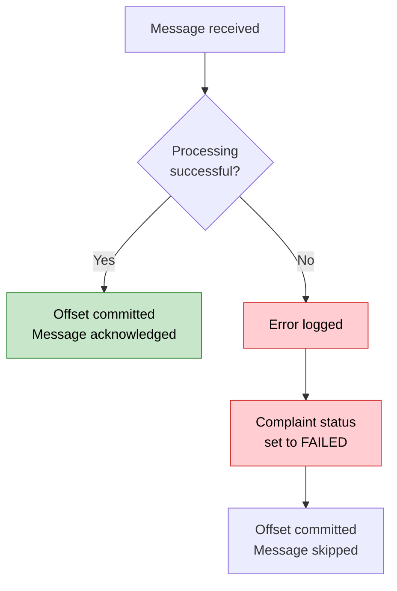
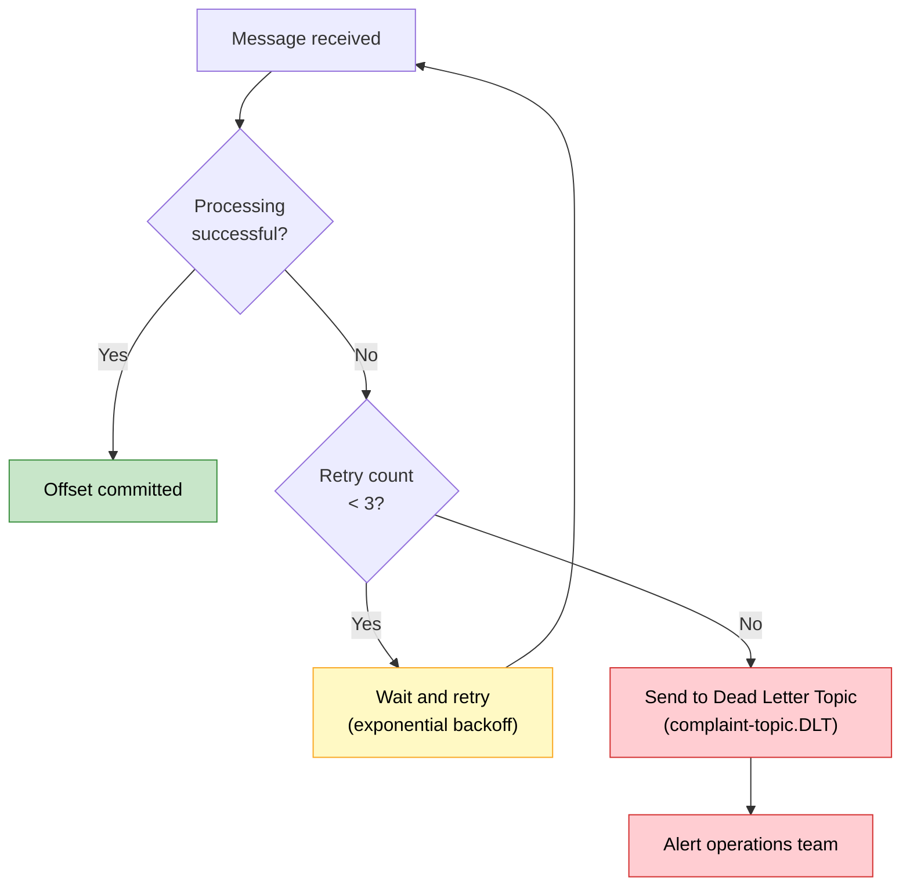
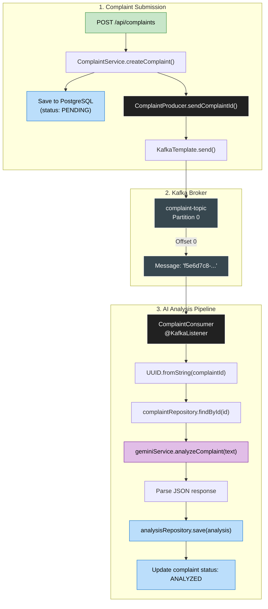

# 📨 Kafka Flow — FoodSense AI

## Table of Contents

- [Why Kafka?](#-why-kafka)
- [Topic Configuration](#-topic-configuration)
- [Producer Flow](#-producer-flow)
- [Consumer Flow](#-consumer-flow)
- [Message Format](#-message-format)
- [Consumer Group Configuration](#-consumer-group-configuration)
- [Error Handling Strategy](#-error-handling-strategy)
- [Flow Diagram](#-flow-diagram)
- [Configuration Properties](#-configuration-properties)

---

## 🤔 Why Kafka?

Apache Kafka serves as the **message broker** between complaint submission and AI analysis. But why not just call the Gemini API directly from the service layer?

### The Problem Without Kafka



**Problems with direct calls:**
- ⏳ **Latency** — Customer waits 3-10 seconds for Gemini to respond
- 💥 **Failure cascade** — If Gemini is down, complaint submission fails entirely
- 🔗 **Tight coupling** — API server is directly dependent on Gemini availability
- 📈 **No scalability** — Each request blocks a thread waiting for Gemini

### The Solution With Kafka



### Benefits of Using Kafka

| Benefit             | Description                                                    |
| ------------------- | -------------------------------------------------------------- |
| **Async Processing**| Customer gets instant response; AI runs in the background      |
| **Decoupling**      | API doesn't know about Gemini; Kafka bridges the gap           |
| **Resilience**      | If Gemini is down, messages queue up and are processed later   |
| **Scalability**     | Add more consumer instances to handle higher throughput        |
| **Reliability**     | Kafka persists messages to disk; no data loss on consumer crash |
| **Backpressure**    | Consumers process at their own pace, not overwhelmed by spikes |

> [!IMPORTANT]
> The key insight is **temporal decoupling** — the producer and consumer don't need to be active at the same time. The complaint can be submitted now and analyzed minutes later if needed.

---

## 📋 Topic Configuration

### Topic Details

| Property           | Value                | Description                           |
| ------------------ | -------------------- | ------------------------------------- |
| **Topic Name**     | `complaint-topic`    | The Kafka topic for complaint events  |
| **Partitions**     | 1                    | Single partition for ordered processing |
| **Replication Factor** | 1                | Single replica (dev environment)      |
| **Retention**      | 7 days (default)     | Messages retained for 7 days         |
| **Cleanup Policy** | `delete`             | Messages deleted after retention      |

### Topic Creation

The topic is auto-created via Spring Boot Kafka configuration:

```java
@Configuration
public class KafkaConfig {

    @Bean
    public NewTopic complaintTopic() {
        return TopicBuilder
            .name("complaint-topic")
            .partitions(1)
            .replicas(1)
            .build();
    }
}
```

> [!NOTE]
> In **production**, you'd increase partitions (for parallelism) and replicas (for fault tolerance). For example: 6 partitions, 3 replicas across a 3-broker cluster.

### Why 1 Partition?

For development and this portfolio project, 1 partition is sufficient because:
- We have a single consumer instance
- Message ordering is preserved (complaints analyzed in submission order)
- Simpler to debug and understand

**For production:** Multiple partitions allow multiple consumer instances to process messages in parallel:



---

## 📤 Producer Flow

### How It Works

The `ComplaintProducer` publishes the complaint **UUID** (not the full object) to the Kafka topic after the complaint is saved to PostgreSQL.



### Producer Code

```java
@Service
@Slf4j
public class ComplaintProducer {

    private final KafkaTemplate<String, String> kafkaTemplate;
    private static final String TOPIC = "complaint-topic";

    public ComplaintProducer(KafkaTemplate<String, String> kafkaTemplate) {
        this.kafkaTemplate = kafkaTemplate;
    }

    public void sendComplaintId(String complaintId) {
        log.info("Publishing complaint ID to Kafka: {}", complaintId);
        kafkaTemplate.send(TOPIC, complaintId);
        log.info("Successfully published complaint ID: {}", complaintId);
    }
}
```

### Why Send Only the ID?

| Approach                | Pros                          | Cons                              |
| ----------------------- | ----------------------------- | --------------------------------- |
| **Send full object**    | Consumer has all data         | Large message size, serialization |
| **Send only ID** ✅     | Small messages, simple format | Consumer must query DB            |

We send **only the UUID** because:
1. **Small message size** — UUIDs are 36 characters vs. potentially large complaint text
2. **Single source of truth** — Database is the source of truth, not Kafka messages
3. **No serialization complexity** — Just a string, no custom serializer needed
4. **Data consistency** — Consumer always gets the latest data from the database

---

## 📥 Consumer Flow

### How It Works

The `ComplaintConsumer` listens to the `complaint-topic`, receives the complaint ID, fetches the full complaint from the database, sends it to Gemini for analysis, and saves the result.



### Consumer Code

```java
@Service
@Slf4j
public class ComplaintConsumer {

    private final ComplaintRepository complaintRepository;
    private final AnalysisRepository analysisRepository;
    private final GeminiService geminiService;

    @KafkaListener(topics = "complaint-topic", groupId = "complaint-analysis-group")
    public void consumeComplaintId(String complaintId) {
        log.info("Received complaint ID from Kafka: {}", complaintId);

        try {
            // 1. Parse UUID
            UUID id = UUID.fromString(complaintId);

            // 2. Fetch complaint from database
            Complaint complaint = complaintRepository.findById(id)
                .orElseThrow(() -> new ResourceNotFoundException(
                    "Complaint not found: " + complaintId));

            // 3. Send to Gemini for analysis
            GeminiAnalysisResult result = geminiService.analyzeComplaint(
                complaint.getComplaintText());

            // 4. Create and save analysis entity
            ComplaintAnalysis analysis = ComplaintAnalysis.builder()
                .complaint(complaint)
                .category(result.getCategory())
                .sentiment(result.getSentiment())
                .priority(result.getPriority())
                .summary(result.getSummary())
                .analyzedAt(LocalDateTime.now())
                .build();

            analysisRepository.save(analysis);

            // 5. Update complaint status
            complaint.setStatus(ComplaintStatus.ANALYZED);
            complaintRepository.save(complaint);

            log.info("Analysis saved for complaint: {}", complaintId);

        } catch (Exception e) {
            log.error("Failed to process complaint: {}", complaintId, e);
            // Update status to FAILED if possible
            handleFailure(complaintId);
        }
    }
}
```

---

## 📦 Message Format

### Message Structure

| Property    | Value                                      |
| ----------- | ------------------------------------------ |
| **Topic**   | `complaint-topic`                          |
| **Key**     | `null` (not partitioned by key)            |
| **Value**   | Complaint UUID as a plain string           |
| **Format**  | Plain text (`String`)                      |
| **Example** | `f5e6d7c8-9a0b-1c2d-3e4f-567890abcdef`   |

### Serialization Configuration

| Component    | Serializer/Deserializer                    |
| ------------ | ------------------------------------------ |
| **Producer** | `StringSerializer` (key), `StringSerializer` (value) |
| **Consumer** | `StringDeserializer` (key), `StringDeserializer` (value) |

```yaml
spring:
  kafka:
    producer:
      key-serializer: org.apache.kafka.common.serialization.StringSerializer
      value-serializer: org.apache.kafka.common.serialization.StringSerializer
    consumer:
      key-deserializer: org.apache.kafka.common.serialization.StringDeserializer
      value-deserializer: org.apache.kafka.common.serialization.StringDeserializer
```

---

## 👥 Consumer Group Configuration

### Consumer Group Details

| Property              | Value                         | Description                               |
| --------------------- | ----------------------------- | ----------------------------------------- |
| **Group ID**          | `complaint-analysis-group`    | Identifies this consumer group            |
| **Auto Offset Reset** | `earliest`                   | Start from beginning if no committed offset |
| **Concurrency**       | 1                            | Single consumer thread                    |
| **Auto Commit**       | `true` (default)             | Offsets committed automatically           |

### What Is a Consumer Group?



A **consumer group** ensures that each message is processed by **exactly one consumer** in the group. If you add more instances of the application, they join the same group and **split the work** across partitions.

> [!TIP]
> **Scaling rule:** The maximum number of consumers that can work in parallel equals the number of partitions. With 6 partitions, you can have up to 6 consumer instances processing concurrently.

---

## 🛡️ Error Handling Strategy

### Current Error Handling (v1.0.0)



### Error Categories

| Error Type                  | Handling                                   | Retryable? |
| --------------------------- | ------------------------------------------ | ---------- |
| **Invalid UUID**            | Log error, skip message                    | No         |
| **Complaint not found**     | Log warning, skip message                  | No         |
| **Gemini API timeout**      | Log error, set status to `FAILED`          | Yes*       |
| **Gemini API rate limit**   | Log error, set status to `FAILED`          | Yes*       |
| **JSON parse error**        | Log error, set status to `FAILED`          | Yes*       |
| **Database error**          | Log error, message may be retried          | Yes        |

> [!WARNING]
> **Current limitation:** There is no automatic retry mechanism in v1.0.0. Failed messages are logged and skipped. A dead letter queue (DLQ) and retry strategy are planned for future releases.

### Planned Improvements (Future)



---

## 🔄 Flow Diagram — Complete Kafka Pipeline



---

## ⚙️ Configuration Properties

### Complete Kafka Configuration

```yaml
# application.yml
spring:
  kafka:
    # Kafka broker connection
    bootstrap-servers: ${KAFKA_BOOTSTRAP_SERVERS:localhost:9092}

    # Producer configuration
    producer:
      key-serializer: org.apache.kafka.common.serialization.StringSerializer
      value-serializer: org.apache.kafka.common.serialization.StringSerializer
      acks: all                    # Wait for all replicas to acknowledge
      retries: 3                   # Retry failed sends 3 times
      properties:
        enable.idempotence: true   # Prevent duplicate messages

    # Consumer configuration
    consumer:
      group-id: complaint-analysis-group
      auto-offset-reset: earliest  # Read from beginning if no offset
      key-deserializer: org.apache.kafka.common.serialization.StringDeserializer
      value-deserializer: org.apache.kafka.common.serialization.StringDeserializer
      properties:
        max.poll.interval.ms: 300000   # 5 min max processing time
        session.timeout.ms: 30000      # 30 sec heartbeat timeout
```

### Configuration Property Reference

| Property                 | Value              | Description                                      |
| ------------------------ | ------------------ | ------------------------------------------------ |
| `bootstrap-servers`      | `localhost:9092`   | Kafka broker addresses                           |
| `producer.acks`          | `all`              | Durability guarantee — all replicas acknowledge  |
| `producer.retries`       | `3`                | Retry failed sends                               |
| `consumer.group-id`      | `complaint-analysis-group` | Consumer group identifier              |
| `consumer.auto-offset-reset` | `earliest`     | Start from oldest unread message                 |
| `max.poll.interval.ms`   | `300000`           | Max time between polls before consumer is kicked |
| `session.timeout.ms`     | `30000`            | Heartbeat timeout for consumer liveness          |

### Docker Compose Kafka Configuration

```yaml
# docker-compose.yml (Kafka section)
kafka:
  image: confluentinc/cp-kafka:7.6.0
  depends_on:
    - zookeeper
  ports:
    - "9092:9092"
  environment:
    KAFKA_BROKER_ID: 1
    KAFKA_ZOOKEEPER_CONNECT: zookeeper:2181
    KAFKA_ADVERTISED_LISTENERS: PLAINTEXT://kafka:9092,PLAINTEXT_HOST://localhost:9092
    KAFKA_LISTENER_SECURITY_PROTOCOL_MAP: PLAINTEXT:PLAINTEXT,PLAINTEXT_HOST:PLAINTEXT
    KAFKA_INTER_BROKER_LISTENER_NAME: PLAINTEXT
    KAFKA_OFFSETS_TOPIC_REPLICATION_FACTOR: 1
    KAFKA_AUTO_CREATE_TOPICS_ENABLE: "true"
```

---

## 📚 Further Reading

- [Architecture Guide](ARCHITECTURE.md) — How Kafka fits into the overall system
- [Gemini Integration](GEMINI_INTEGRATION.md) — What happens after Kafka delivers the message
- [Deployment Guide](DEPLOYMENT.md) — Kafka configuration in production
