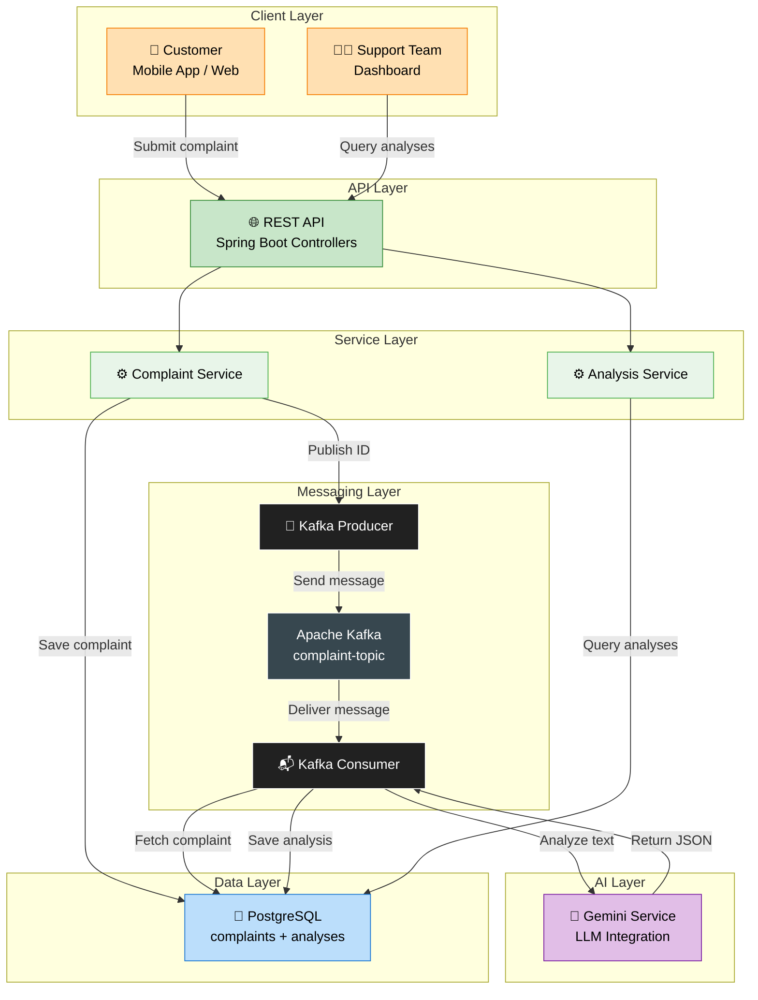
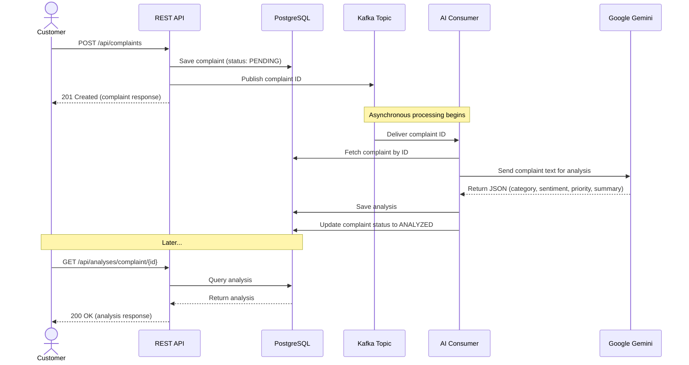

# 📖 Project Overview — FoodSense AI

## Table of Contents

- [Purpose](#-purpose)
- [Business Value](#-business-value)
- [Target Audience](#-target-audience)
- [Tech Stack](#-tech-stack)
- [High-Level Architecture](#-high-level-architecture)
- [Key Features](#-key-features)
- [How It Works (End-to-End)](#-how-it-works-end-to-end)
- [Project Goals & Learning Outcomes](#-project-goals--learning-outcomes)

---

## 🎯 Purpose

**FoodSense AI** is an intelligent complaint analysis system built for food delivery platforms. It automates the process of reading, categorizing, and prioritizing customer complaints using Google Gemini (Large Language Model).

In a real-world food delivery company, support teams receive **thousands of complaints daily**. Manually reading and categorizing each one is:

- ⏳ **Time-consuming** — human reviewers need minutes per complaint
- ❌ **Error-prone** — inconsistent categorization across team members
- 💰 **Expensive** — requires large support teams

FoodSense AI solves this by automating the analysis in **seconds** with consistent, AI-powered categorization.

---

## 💼 Business Value

| Metric                  | Without FoodSense AI        | With FoodSense AI             |
| ----------------------- | --------------------------- | ----------------------------- |
| **Processing Time**     | 3-5 minutes per complaint   | < 5 seconds per complaint     |
| **Consistency**         | Varies by reviewer          | 100% consistent categorization |
| **Scalability**         | Limited by team size        | Scales horizontally with Kafka |
| **Prioritization**      | Manual triage               | Automatic priority assignment  |
| **Cost**                | $15-25/hour per reviewer    | Pennies per API call           |
| **Availability**        | Business hours only         | 24/7 automated processing     |

> [!IMPORTANT]
> The real business impact is **speed + consistency**. High-priority complaints (e.g., food safety issues) get flagged immediately instead of sitting in a queue.

### Business Use Cases

1. **Real-Time Triage** — Critical complaints (food poisoning, allergic reactions) are flagged as `CRITICAL` priority immediately
2. **Trend Analysis** — Track complaint categories over time to identify systemic issues (e.g., a surge in `DELIVERY` complaints in a specific area)
3. **Restaurant Performance** — Aggregate complaint data per restaurant to identify underperformers
4. **Customer Retention** — Fast response to high-priority complaints reduces churn

---

## 🎓 Target Audience

This project is designed for **junior and associate backend developers** who want to:

- Build a **portfolio-worthy** project that demonstrates real-world backend skills
- Learn **event-driven architecture** with Apache Kafka
- Practice **LLM/AI integration** in a backend context
- Understand **clean architecture** principles (layered architecture, SOLID, design patterns)
- Gain experience with **Docker** and containerized development
- See how **Spring Boot 3** and **Java 21** work together in a modern application

> [!TIP]
> If you're a junior developer, read the [Architecture Guide](ARCHITECTURE.md) after this overview. It explains every design decision with beginner-friendly explanations.

### Prerequisites for Understanding This Project

| Skill Level          | Recommended Knowledge                                      |
| -------------------- | ---------------------------------------------------------- |
| **Must Have**        | Basic Java, REST APIs, SQL fundamentals                    |
| **Should Have**      | Spring Boot basics, Maven, Git                             |
| **Nice to Have**     | Docker basics, messaging concepts, OOP design patterns     |
| **Will Learn**       | Kafka, Gemini LLM, event-driven architecture, prompt engineering |

---

## 🛠️ Tech Stack

### Core Technologies

| Layer               | Technology           | Version  | Purpose                                                |
| ------------------- | -------------------- | -------- | ------------------------------------------------------ |
| **Language**        | Java                 | 21 (LTS) | Core programming language with modern features         |
| **Framework**       | Spring Boot          | 3.4.x    | Application framework, DI, auto-configuration          |
| **Messaging**       | Apache Kafka         | 3.7      | Asynchronous event streaming between producer/consumer |
| **Database**        | PostgreSQL           | 16       | Relational storage for complaints and analyses         |
| **AI Engine**       | Google Gemini        | 2.0 Flash| Natural language understanding and structured extraction |
| **API Docs**        | SpringDoc OpenAPI    | 2.8      | Auto-generated Swagger UI and OpenAPI 3.0 spec         |

### Infrastructure & DevOps

| Tool                | Purpose                                                          |
| ------------------- | ---------------------------------------------------------------- |
| **Docker**          | Containerization of all services                                 |
| **Docker Compose**  | Multi-container orchestration (Postgres, Kafka, Zookeeper, App)  |
| **Maven**           | Build tool, dependency management, test execution                |

### Testing

| Tool              | Purpose                                              |
| ----------------- | ---------------------------------------------------- |
| **JUnit 5**       | Test framework                                       |
| **Mockito**       | Mocking dependencies in unit tests                   |
| **MockMvc**       | Testing REST controllers without starting full server |
| **Spring Boot Test** | Test auto-configuration and context loading        |

---

## 🏗️ High-Level Architecture

---

## ✨ Key Features

### Core Features (v1.0.0)

| Feature                        | Description                                                    |
| ------------------------------ | -------------------------------------------------------------- |
| 🆕 **Complaint Submission**    | REST API to submit customer complaints with full details       |
| 🤖 **AI Analysis**            | Automatic category, sentiment, priority, and summary extraction |
| 📨 **Async Processing**       | Kafka-based decoupled processing for scalability               |
| 📊 **Analysis Retrieval**     | REST APIs to query analyses by ID or complaint                 |
| 📝 **Swagger UI**             | Interactive API documentation accessible via browser           |
| 🐳 **Docker Compose**         | One-command infrastructure setup                               |
| 🧪 **Unit Tests**             | Comprehensive test suite with JUnit 5 + Mockito               |
| 📚 **Documentation**          | Full project documentation for portfolio presentation          |

### Analysis Capabilities

The AI engine extracts four key data points from each complaint:

| Field          | Type     | Values                                                        |
| -------------- | -------- | ------------------------------------------------------------- |
| **Category**   | Enum     | `DELIVERY`, `FOOD_QUALITY`, `CUSTOMER_SERVICE`, `BILLING`, `APP_ISSUE`, `OTHER` |
| **Sentiment**  | Enum     | `POSITIVE`, `NEGATIVE`, `NEUTRAL`                             |
| **Priority**   | Enum     | `LOW`, `MEDIUM`, `HIGH`, `CRITICAL`                           |
| **Summary**    | String   | Concise 1-2 sentence summary of the complaint                 |

---

## 🔄 How It Works (End-to-End)

Here's the complete flow from complaint submission to analysis retrieval:

### Step-by-Step Breakdown

1. **Customer submits complaint** via `POST /api/complaints` with complaint text, customer details, and order info
2. **REST API saves** the complaint to PostgreSQL with status `PENDING`
3. **Kafka Producer publishes** the complaint ID to the `complaint-topic`
4. **API returns** `201 Created` immediately — customer doesn't wait for AI processing
5. **Kafka Consumer picks up** the message from `complaint-topic`
6. **Consumer fetches** the full complaint from PostgreSQL using the complaint ID
7. **Consumer sends** the complaint text to Google Gemini with a structured prompt
8. **Gemini analyzes** the text and returns a JSON object with category, sentiment, priority, and summary
9. **Consumer parses** the JSON response and creates a `ComplaintAnalysis` entity
10. **Consumer saves** the analysis to PostgreSQL and updates the complaint status to `ANALYZED`
11. **Support team queries** analyses via `GET /api/analyses` to view categorized, prioritized complaints

---

## 🎯 Project Goals & Learning Outcomes

By studying and/or building this project, you will gain practical experience with:

| Skill Area                   | What You'll Learn                                                 |
| ---------------------------- | ----------------------------------------------------------------- |
| **REST API Design**          | Building CRUD APIs with Spring Boot, proper HTTP status codes     |
| **Event-Driven Architecture**| Producer-consumer pattern with Apache Kafka                       |
| **LLM Integration**          | Prompt engineering, API calls, JSON parsing from AI responses     |
| **Clean Architecture**       | Layered architecture, separation of concerns, SOLID principles   |
| **Design Patterns**          | Repository, DTO, Builder, Producer-Consumer patterns             |
| **Database Design**          | JPA entities, relationships, enum mapping, schema design         |
| **Testing**                  | Unit testing services and controllers with mocks                 |
| **Docker**                   | Multi-container applications with Docker Compose                 |
| **Documentation**            | Writing professional, comprehensive project documentation        |

> [!NOTE]
> This project is designed to be **read, understood, and extended**. Every architectural decision is documented, and the codebase follows clean, consistent conventions that you can apply to your own projects.

---

## 📚 Next Steps

| Document                                           | Read This If You Want To...                                |
| -------------------------------------------------- | ---------------------------------------------------------- |
| [Architecture Guide](ARCHITECTURE.md)              | Understand the system design and patterns                  |
| [Setup Guide](SETUP_GUIDE.md)                      | Run the project locally                                    |
| [API Documentation](API_DOCUMENTATION.md)          | Explore all API endpoints                                  |
| [Kafka Flow](KAFKA_FLOW.md)                        | Understand the event-driven pipeline                       |
| [Gemini Integration](GEMINI_INTEGRATION.md)        | Learn about LLM integration and prompt engineering         |
| [Database Schema](DATABASE_SCHEMA.md)              | See the data model                                         |
| [Testing Guide](TESTING.md)                        | Understand the testing strategy                            |
| [Deployment Guide](DEPLOYMENT.md)                  | Deploy to production                                       |
