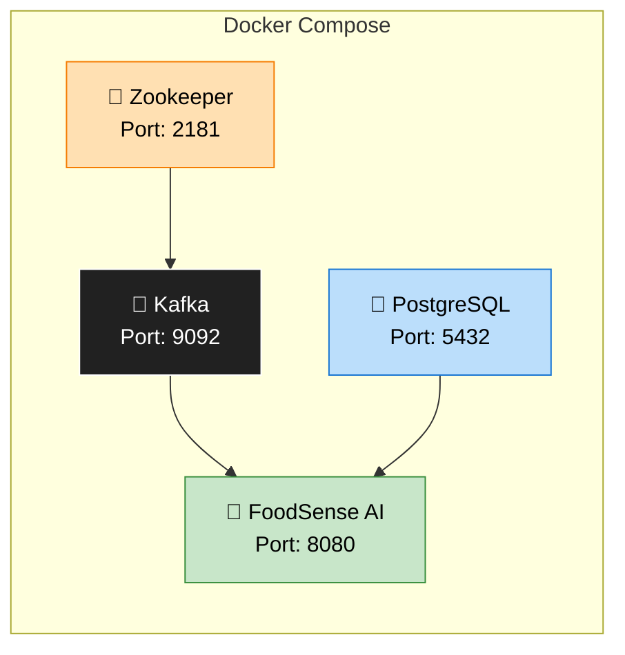
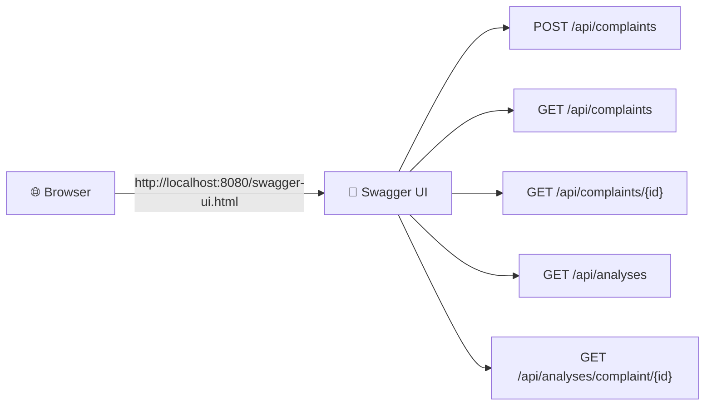

# 🛠️ Setup Guide — FoodSense AI

## Table of Contents

- [Prerequisites](#-prerequisites)
- [Clone the Repository](#-step-1-clone-the-repository)
- [Configure Environment Variables](#-step-2-configure-environment-variables)
- [Start with Docker Compose](#-step-3-start-with-docker-compose)
- [Run the Application](#-step-4-run-the-application)
- [Verify Setup](#-step-5-verify-setup)
- [Troubleshooting](#-troubleshooting)

---

## ✅ Prerequisites

Ensure the following tools are installed on your machine before proceeding:

| Tool             | Required Version | Download Link                                      | Verify Command               |
| ---------------- | ---------------- | -------------------------------------------------- | ---------------------------- |
| **Java (JDK)**   | 21 (LTS)         | [Adoptium](https://adoptium.net/)                  | `java -version`              |
| **Maven**        | 3.9+             | [Maven](https://maven.apache.org/download.cgi)     | `mvn -version`               |
| **Docker**       | 24+              | [Docker Desktop](https://www.docker.com/products/docker-desktop/) | `docker --version`   |
| **Docker Compose** | 2.20+          | Included with Docker Desktop                       | `docker compose version`     |
| **Git**          | 2.40+            | [Git](https://git-scm.com/downloads)               | `git --version`              |

> [!IMPORTANT]
> **Java 21 is required.** This project uses Java 21 features and Spring Boot 3.4 which requires Java 17+. We recommend Java 21 (LTS) for the latest features.

### Verify Your Environment

Run these commands to verify everything is installed:

```bash
# Check Java version (should show 21.x)
java -version

# Check Maven version (should show 3.9+)
mvn -version

# Check Docker (should show 24+)
docker --version

# Check Docker Compose (should show 2.20+)
docker compose version
```

**Expected output:**

```
openjdk version "21.0.3" 2024-04-16 LTS
Apache Maven 3.9.6
Docker version 24.0.7
Docker Compose version v2.23.0
```

### Get a Gemini API Key

You'll need a **Google Gemini API key** to enable AI analysis:

1. Go to [Google AI Studio](https://aistudio.google.com/apikey)
2. Sign in with your Google account
3. Click **"Create API Key"**
4. Copy the generated key

> [!TIP]
> The Gemini API has a generous **free tier** — perfect for development and testing. You get 15 requests per minute and 1,500 requests per day for free with `gemini-2.0-flash`.

---

## 📂 Step 1 — Clone the Repository

```bash
# Clone the repository
git clone https://github.com/your-username/foodsense-ai.git

# Navigate into the project directory
cd foodsense-ai
```

**Project structure after cloning:**

```
foodsense-ai/
├── src/                    # Java source code
├── docs/                   # Documentation
├── docker-compose.yml      # Infrastructure definition
├── Dockerfile              # Application container build
├── pom.xml                 # Maven project definition
├── .env.example            # Example environment variables
└── README.md               # Project overview
```

---

## 🔑 Step 2 — Configure Environment Variables

### Create the `.env` File

Create a `.env` file in the **project root** (same directory as `docker-compose.yml`):

```bash
# Copy the example environment file
cp .env.example .env
```

Or manually create the file:

```env
# ===========================================
# FoodSense AI — Environment Configuration
# ===========================================

# Google Gemini API Key (REQUIRED)
# Get yours at: https://aistudio.google.com/apikey
GEMINI_API_KEY=your-google-gemini-api-key-here

# PostgreSQL Configuration
POSTGRES_DB=foodsense
POSTGRES_USER=postgres
POSTGRES_PASSWORD=postgres
DB_HOST=postgres
DB_PORT=5432

# Kafka Configuration
KAFKA_BOOTSTRAP_SERVERS=kafka:9092

# Application Configuration
SERVER_PORT=8080
```

> [!CAUTION]
> **Never commit your `.env` file to Git!** It contains your API key. The `.gitignore` file should already exclude it, but double-check:
> ```bash
> echo ".env" >> .gitignore
> ```

### Environment Variable Reference

| Variable                  | Default        | Description                             | Required |
| ------------------------- | -------------- | --------------------------------------- | -------- |
| `GEMINI_API_KEY`          | —              | Google Gemini API key for LLM analysis  | ✅ Yes    |
| `POSTGRES_DB`             | `foodsense`    | PostgreSQL database name                | No       |
| `POSTGRES_USER`           | `postgres`     | PostgreSQL username                     | No       |
| `POSTGRES_PASSWORD`       | `postgres`     | PostgreSQL password                     | No       |
| `DB_HOST`                 | `postgres`     | PostgreSQL host (container name)        | No       |
| `DB_PORT`                 | `5432`         | PostgreSQL port                         | No       |
| `KAFKA_BOOTSTRAP_SERVERS` | `kafka:9092`   | Kafka broker address                    | No       |
| `SERVER_PORT`             | `8080`         | Application server port                 | No       |

---

## 🐳 Step 3 — Start with Docker Compose

### Start All Services

Docker Compose will start **PostgreSQL**, **Zookeeper**, **Kafka**, and the **Spring Boot application**:

```bash
# Start all services in detached mode
docker compose up -d
```

### Docker Compose Services



| Service        | Container Name | Port   | Purpose                           |
| -------------- | -------------- | ------ | --------------------------------- |
| **Zookeeper**  | `zookeeper`    | 2181   | Kafka cluster coordination        |
| **Kafka**      | `kafka`        | 9092   | Message broker                    |
| **PostgreSQL** | `postgres`     | 5432   | Relational database               |
| **Application**| `foodsense-app`| 8080   | Spring Boot API server            |

### Verify Containers Are Running

```bash
# Check all container statuses
docker compose ps
```

**Expected output:**

```
NAME              STATUS     PORTS
zookeeper         Up         0.0.0.0:2181->2181/tcp
kafka             Up         0.0.0.0:9092->9092/tcp
postgres          Up         0.0.0.0:5432->5432/tcp
foodsense-app     Up         0.0.0.0:8080->8080/tcp
```

### View Application Logs

```bash
# View all logs
docker compose logs -f

# View only the application logs
docker compose logs -f foodsense-app

# View only Kafka logs
docker compose logs -f kafka
```

### Stop All Services

```bash
# Stop and remove containers
docker compose down

# Stop and remove containers + volumes (deletes database data)
docker compose down -v
```

---

## 🖥️ Step 4 — Run the Application (Without Docker)

If you prefer to run the Spring Boot application **locally** (outside Docker) while using Docker for infrastructure:

### 4a. Start Only Infrastructure

```bash
# Start only PostgreSQL, Kafka, and Zookeeper
docker compose up -d postgres kafka zookeeper
```

### 4b. Update Application Properties

When running locally, update `application.yml` to use `localhost` instead of container names:

```yaml
spring:
  datasource:
    url: jdbc:postgresql://localhost:5432/foodsense
  kafka:
    bootstrap-servers: localhost:9092
```

### 4c. Run with Maven

```bash
# Build and run
mvn spring-boot:run

# Or build first, then run the JAR
mvn clean package -DskipTests
java -jar target/foodsense-ai-0.0.1-SNAPSHOT.jar
```

### 4d. Run with IDE

1. Open the project in **IntelliJ IDEA** or **VS Code**
2. Navigate to `src/main/java/com/foodsense/ai/FoodSenseAiApplication.java`
3. Click the **Run** button (▶️) next to the `main` method
4. Set the `GEMINI_API_KEY` environment variable in your run configuration

> [!TIP]
> **IntelliJ IDEA Users:** Go to Run → Edit Configurations → Environment Variables → Add `GEMINI_API_KEY=your-key-here`

---

## ✔️ Step 5 — Verify Setup

### 5a. Health Check

```bash
# Check if the application is running
curl http://localhost:8080/actuator/health
```

**Expected response:**

```json
{
  "status": "UP"
}
```

### 5b. Access Swagger UI

Open your browser and navigate to:

```
http://localhost:8080/swagger-ui.html
```

You should see the interactive Swagger UI with all API endpoints documented.



### 5c. Submit a Test Complaint

```bash
curl -X POST http://localhost:8080/api/complaints \
  -H "Content-Type: application/json" \
  -d '{
    "customerName": "Jane Smith",
    "customerEmail": "jane.smith@email.com",
    "complaintText": "I ordered a pizza from PizzaHut via your app and it arrived 2 hours late. The food was cold and the delivery driver was rude. I want a full refund.",
    "restaurantName": "PizzaHut",
    "orderNumber": "ORD-2026-78432"
  }'
```

**Expected response (201 Created):**

```json
{
  "id": "f5e6d7c8-9a0b-1c2d-3e4f-567890abcdef",
  "customerName": "Jane Smith",
  "customerEmail": "jane.smith@email.com",
  "complaintText": "I ordered a pizza from PizzaHut via your app and it arrived 2 hours late...",
  "restaurantName": "PizzaHut",
  "orderNumber": "ORD-2026-78432",
  "status": "PENDING",
  "createdAt": "2026-05-30T17:00:00"
}
```

### 5d. Check the Analysis (after a few seconds)

```bash
# Wait 3-5 seconds for Kafka + Gemini processing, then:
curl http://localhost:8080/api/analyses | jq
```

**Expected response:**

```json
[
  {
    "id": "a1b2c3d4-e5f6-7890-abcd-ef1234567890",
    "complaintId": "f5e6d7c8-9a0b-1c2d-3e4f-567890abcdef",
    "category": "DELIVERY",
    "sentiment": "NEGATIVE",
    "priority": "HIGH",
    "summary": "Customer reports a 2-hour delivery delay with cold food and rude driver behavior. Requests full refund.",
    "analyzedAt": "2026-05-30T17:00:00"
  }
]
```

---

## 🔧 Troubleshooting

### Common Issues

#### 1. Port Already in Use

**Error:** `Bind for 0.0.0.0:8080 failed: port is already allocated`

**Solution:**
```bash
# Find what's using the port
# Linux/Mac:
lsof -i :8080

# Windows:
netstat -ano | findstr :8080

# Kill the process or change the port in docker-compose.yml
```

---

#### 2. Kafka Connection Refused

**Error:** `Connection to node -1 (localhost:9092) could not be established`

**Possible causes:**
- Kafka container hasn't fully started yet
- Running the app locally but Kafka is on Docker network

**Solution:**
```bash
# Check if Kafka container is running
docker compose ps kafka

# Wait for Kafka to be ready (can take 15-30 seconds)
docker compose logs -f kafka

# Look for: "started (kafka.server.KafkaServer)"
```

> [!TIP]
> If running the app **locally** (not in Docker), make sure Kafka is advertising `localhost:9092`. Check the `KAFKA_ADVERTISED_LISTENERS` in `docker-compose.yml`.

---

#### 3. PostgreSQL Connection Refused

**Error:** `Connection to localhost:5432 refused`

**Solution:**
```bash
# Check if PostgreSQL container is running
docker compose ps postgres

# Check PostgreSQL logs
docker compose logs postgres

# Verify you can connect
docker exec -it postgres psql -U postgres -d foodsense -c "SELECT 1;"
```

---

#### 4. Gemini API Key Invalid

**Error:** `401 Unauthorized` or `API key not valid`

**Solution:**
1. Verify your API key at [Google AI Studio](https://aistudio.google.com/apikey)
2. Check the `.env` file — no quotes around the key value:
   ```env
   # ✅ Correct
   GEMINI_API_KEY=AIzaSyB1234567890abcdefgh

   # ❌ Wrong
   GEMINI_API_KEY="AIzaSyB1234567890abcdefgh"
   ```
3. Ensure the environment variable is loaded:
   ```bash
   docker compose exec foodsense-app env | grep GEMINI
   ```

---

#### 5. Docker Compose Build Failures

**Error:** `failed to build` or `COPY failed`

**Solution:**
```bash
# Clean rebuild
docker compose down -v
docker compose build --no-cache
docker compose up -d
```

---

#### 6. Out of Memory (Docker)

**Error:** Application crashes or Kafka becomes unresponsive.

**Solution:** Increase Docker Desktop memory allocation:
- Docker Desktop → Settings → Resources → Memory → Set to at least **4 GB**

---

#### 7. Application Starts But No Analysis Generated

**Possible causes:**
- Gemini API key not set
- Kafka consumer not connected
- Gemini API rate limit reached

**Debugging steps:**
```bash
# Check application logs for errors
docker compose logs -f foodsense-app

# Look for:
# ✅ "Kafka consumer started"
# ✅ "Received complaint ID: ..."
# ✅ "Analysis saved for complaint: ..."
# ❌ "Error calling Gemini API: ..."
# ❌ "Failed to parse Gemini response: ..."
```

---

### Resetting Everything

If something is fundamentally broken, reset the entire environment:

```bash
# Nuclear option — remove everything and start fresh
docker compose down -v --remove-orphans
docker system prune -f
docker compose up -d --build
```

> [!WARNING]
> The `-v` flag **deletes all database data**. Only use this if you want a completely fresh start.

---

## 📚 Next Steps

Once your setup is verified:

1. 📘 Read the [API Documentation](API_DOCUMENTATION.md) to explore all endpoints
2. 🔬 Check the [Architecture Guide](ARCHITECTURE.md) to understand the design
3. 📨 Learn about [Kafka Flow](KAFKA_FLOW.md) for event-driven processing
4. 🤖 Explore [Gemini Integration](GEMINI_INTEGRATION.md) for LLM details
5. 🧪 Run the [test suite](TESTING.md) to verify code quality
