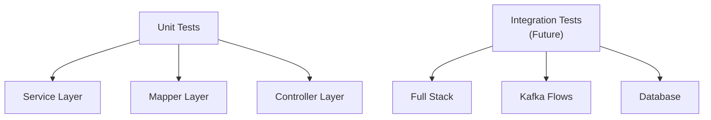

# 🧪 Testing Guide

## Testing Strategy

FoodSense AI follows a **layered testing approach** to ensure code quality and reliability:



## Test Stack

| Tool | Purpose |
|------|---------|
| **JUnit 5** | Test framework with `@DisplayName`, `@Nested`, parameterized tests |
| **Mockito** | Mocking framework for isolating units under test |
| **MockMvc** | Spring MVC test support for controller endpoint testing |
| **Spring Boot Test** | `@WebMvcTest`, `@SpringBootTest` for integration testing |
| **AssertJ** | Fluent assertion library for readable test assertions |

## Project Test Structure

```
src/test/java/com/foodsense/ai/
├── FoodSenseAiApplicationTests.java    # Smoke test
├── controller/
│   └── ComplaintControllerTest.java    # @WebMvcTest controller tests
├── mapper/
│   └── ComplaintMapperTest.java        # Pure unit tests (no Spring context)
└── service/
    ├── ComplaintServiceTest.java       # Mockito-based service tests
    └── GeminiServiceTest.java          # WebClient mock chain tests
```

## Running Tests

### Run All Tests
```bash
mvn test
```

### Run a Specific Test Class
```bash
mvn test -Dtest=ComplaintServiceTest
```

### Run Tests with Verbose Output
```bash
mvn test -Dtest=ComplaintServiceTest -Dsurefire.useFile=false
```

### Generate Test Report
```bash
mvn surefire-report:report
```
Report will be available at `target/site/surefire-report.html`.

---

## Test Categories

### 1. Unit Tests — Service Layer

**File:** `ComplaintServiceTest.java`

Uses `@ExtendWith(MockitoExtension.class)` with `@Mock` and `@InjectMocks` to isolate the service from its dependencies.

**Coverage:**
| Test | Description |
|------|-------------|
| `submitComplaint_ShouldSaveAndPublish` | Verifies complaint is saved to DB and published to Kafka |
| `getComplaintById_ShouldReturnComplaint` | Verifies successful retrieval by ID |
| `getComplaintById_ShouldThrowWhenNotFound` | Verifies `ResourceNotFoundException` when ID doesn't exist |
| `getAllComplaints_ShouldReturnList` | Verifies list retrieval with proper DTO mapping |
| `getAllComplaints_ShouldReturnEmptyList` | Verifies empty list handling |

**Example:**
```java
@Test
@DisplayName("Should save complaint and publish to Kafka")
void submitComplaint_ShouldSaveAndPublish() {
    // Given
    given(complaintRepository.save(any(Complaint.class))).willReturn(complaint);

    // When
    ComplaintResponseDto result = complaintService.submitComplaint(requestDto);

    // Then
    assertThat(result.getCustomerName()).isEqualTo("John Doe");
    verify(complaintProducer).sendComplaint(complaint.getId().toString());
}
```

### 2. Unit Tests — Gemini Service

**File:** `GeminiServiceTest.java`

Tests the Gemini API integration with mocked WebClient chain.

**Coverage:**
| Test | Description |
|------|-------------|
| `analyzeComplaint_ShouldReturnAnalysis` | Verifies successful API call and response parsing |
| `analyzeComplaint_ShouldHandleMarkdownWrappedJson` | Handles ` ```json ... ``` ` wrapped responses |
| `analyzeComplaint_ShouldParsePositiveSentiment` | Verifies parsing of different sentiment values |
| `analyzeComplaint_ShouldThrowOnApiError` | Verifies `GeminiAnalysisException` on API failure |
| `analyzeComplaint_ShouldThrowOnInvalidJson` | Verifies error handling for malformed responses |

### 3. Controller Tests

**File:** `ComplaintControllerTest.java`

Uses `@WebMvcTest(ComplaintController.class)` with `MockMvc` to test HTTP endpoints without starting the full server.

**Coverage:**
| Test | Description |
|------|-------------|
| `submitComplaint_ShouldReturn201` | POST with valid body returns 201 Created |
| `submitComplaint_ShouldReturn400_BlankName` | POST with blank `customerName` returns 400 |
| `submitComplaint_ShouldReturn400_ShortText` | POST with text < 10 chars returns 400 |
| `submitComplaint_ShouldReturn400_MissingText` | POST with missing `complaintText` returns 400 |
| `getAllComplaints_ShouldReturn200` | GET returns 200 with list |
| `getComplaintById_ShouldReturn200` | GET with valid ID returns 200 |
| `getComplaintById_ShouldReturn404` | GET with unknown ID returns 404 |

**Example:**
```java
@Test
@DisplayName("POST /api/complaints should return 201 with valid input")
void submitComplaint_ShouldReturn201() throws Exception {
    given(complaintService.submitComplaint(any())).willReturn(responseDto);

    mockMvc.perform(post("/api/complaints")
            .contentType(MediaType.APPLICATION_JSON)
            .content(objectMapper.writeValueAsString(requestDto)))
            .andExpect(status().isCreated())
            .andExpect(jsonPath("$.customerName").value("John Doe"));
}
```

### 4. Mapper Tests

**File:** `ComplaintMapperTest.java`

Pure JUnit 5 tests — no Spring context needed, making them extremely fast.

**Coverage:**
| Test | Description |
|------|-------------|
| `toEntity_ShouldMapFieldsCorrectly` | DTO → Entity field mapping |
| `toEntity_ShouldHandleNullValues` | Null safety check |
| `toEntity_ShouldHandleEdgeCaseStrings` | Unicode, special chars, long strings |
| `toResponseDto_ShouldMapFieldsCorrectly` | Entity → DTO field mapping |
| `toResponseDto_ShouldHandleNullFields` | Null field handling |
| `toResponseDtoList_ShouldMapAllElements` | List mapping correctness |
| `toResponseDtoList_ShouldReturnEmptyList` | Empty list handling |
| `toResponseDtoList_ShouldHandleSingleElement` | Single-element list |

---

## Mocking Strategy

### Dependencies Mocked
| Component | Mock Type | Mocked Dependencies |
|-----------|-----------|-------------------|
| `ComplaintService` | `@Mock` | `ComplaintRepository`, `ComplaintProducer` |
| `GeminiService` | `@Mock` | `WebClient` (full chain) |
| `ComplaintController` | `@MockBean` | `ComplaintService` |

### Why Mock?
- **Isolation**: Each unit is tested independently
- **Speed**: No database, Kafka, or HTTP calls needed
- **Reliability**: Tests don't depend on external services
- **Determinism**: Same inputs always produce same outputs

---

## Test Coverage Goals

| Layer | Current | Target |
|-------|---------|--------|
| Service | ~85% | 90%+ |
| Controller | ~80% | 85%+ |
| Mapper | ~95% | 95%+ |
| Overall | ~80% | 85%+ |

---

## Future Testing Plans

### Integration Tests
- Embedded PostgreSQL with Testcontainers
- Embedded Kafka for end-to-end flow testing
- Full context load tests

### Performance Tests
- JMeter / Gatling load testing
- Kafka throughput benchmarking
- Gemini API latency profiling

### Contract Tests
- Consumer-driven contract testing for API stability
